# List of Icons

| Icon name  | Preview  | Code |
|---|---|---|
| about | 

 | `import 'package:koukicons/about.dart';` `KoukiconsAbout(), `|
| acceptDatabase | 

 | `import 'package:koukicons/acceptDatabase.dart';` `KoukiconsAcceptDatabase(), `|
| add | 

 | `import 'package:koukicons/add.dart';` `KoukiconsAdd(), `|
| add2 | 

 | `import 'package:koukicons/add2.dart';` `KoukiconsAdd2(), `|
| add3 | 

 | `import 'package:koukicons/add3.dart';` `KoukiconsAdd3(), `|
| addApp | 

 | `import 'package:koukicons/addApp.dart';` `KoukiconsAddApp(), `|
| addColumn | 

 | `import 'package:koukicons/addColumn.dart';` `KoukiconsAddColumn(), `|
| addDatabase | 

 | `import 'package:koukicons/addDatabase.dart';` `KoukiconsAddDatabase(), `|
| addImage | 

 | `import 'package:koukicons/addImage.dart';` `KoukiconsAddImage(), `|
| addressBook | 

 | `import 'package:koukicons/addressBook.dart';` `KoukiconsAddressBook(), `|
| addRow | 

 | `import 'package:koukicons/addRow.dart';` `KoukiconsAddRow(), `|
| addWin | 

 | `import 'package:koukicons/addWin.dart';` `KoukiconsAddWin(), `|
| advance | 

 | `import 'package:koukicons/advance.dart';` `KoukiconsAdvance(), `|
| advertising | 

 | `import 'package:koukicons/advertising.dart';` `KoukiconsAdvertising(), `|
| airdrop | 

 | `import 'package:koukicons/airdrop.dart';` `KoukiconsAirdrop(), `|
| airplay | 

 | `import 'package:koukicons/airplay.dart';` `KoukiconsAirplay(), `|
| alarm1 | 

 | `import 'package:koukicons/alarm1.dart';` `KoukiconsAlarm1(), `|
| alarm2 | 

 | `import 'package:koukicons/alarm2.dart';` `KoukiconsAlarm2(), `|
| alarmClock | 

 | `import 'package:koukicons/alarmClock.dart';` `KoukiconsAlarmClock(), `|
| alarmoff | 

 | `import 'package:koukicons/alarmoff.dart';` `KoukiconsAlarmoff(), `|
| album | 

 | `import 'package:koukicons/album.dart';` `KoukiconsAlbum(), `|
| albumCd | 

 | `import 'package:koukicons/albumCd.dart';` `KoukiconsAlbumCd(), `|
| albums | 

 | `import 'package:koukicons/albums.dart';` `KoukiconsAlbums(), `|
| albums2 | 

 | `import 'package:koukicons/albums2.dart';` `KoukiconsAlbums2(), `|
| albumsView | 

 | `import 'package:koukicons/albumsView.dart';` `KoukiconsAlbumsView(), `|
| alphabeticalSortingAz | 

 | `import 'package:koukicons/alphabeticalSortingAz.dart';` `KoukiconsAlphabeticalSortingAz(), `|
| alphabeticalSortingZa | 

 | `import 'package:koukicons/alphabeticalSortingZa.dart';` `KoukiconsAlphabeticalSortingZa(), `|
| answers | 

 | `import 'package:koukicons/answers.dart';` `KoukiconsAnswers(), `|
| approval | 

 | `import 'package:koukicons/approval.dart';` `KoukiconsApproval(), `|
| approve | 

 | `import 'package:koukicons/approve.dart';` `KoukiconsApprove(), `|
| archive | 

 | `import 'package:koukicons/archive.dart';` `KoukiconsArchive(), `|
| archive2 | 

 | `import 'package:koukicons/archive2.dart';` `KoukiconsArchive2(), `|
| archive3 | 

 | `import 'package:koukicons/archive3.dart';` `KoukiconsArchive3(), `|
| areaChart | 

 | `import 'package:koukicons/areaChart.dart';` `KoukiconsAreaChart(), `|
| assistant | 

 | `import 'package:koukicons/assistant.dart';` `KoukiconsAssistant(), `|
| attach | 

 | `import 'package:koukicons/attach.dart';` `KoukiconsAttach(), `|
| audioFile | 

 | `import 'package:koukicons/audioFile.dart';` `KoukiconsAudioFile(), `|
| automatic | 

 | `import 'package:koukicons/automatic.dart';` `KoukiconsAutomatic(), `|
| automotive | 

 | `import 'package:koukicons/automotive.dart';` `KoukiconsAutomotive(), `|
| back | 

 | `import 'package:koukicons/back.dart';` `KoukiconsBack(), `|
| back2 | 

 | `import 'package:koukicons/back2.dart';` `KoukiconsBack2(), `|
| badDecision | 

 | `import 'package:koukicons/badDecision.dart';` `KoukiconsBadDecision(), `|
| barChart | 

 | `import 'package:koukicons/barChart.dart';` `KoukiconsBarChart(), `|
| bearish | 

 | `import 'package:koukicons/bearish.dart';` `KoukiconsBearish(), `|
| binoculars | 

 | `import 'package:koukicons/binoculars.dart';` `KoukiconsBinoculars(), `|
| biohazard | 

 | `import 'package:koukicons/biohazard.dart';` `KoukiconsBiohazard(), `|
| biomass | 

 | `import 'package:koukicons/biomass.dart';` `KoukiconsBiomass(), `|
| biotech | 

 | `import 'package:koukicons/biotech.dart';` `KoukiconsBiotech(), `|
| blueprint | 

 | `import 'package:koukicons/blueprint.dart';` `KoukiconsBlueprint(), `|
| bluetooth | 

 | `import 'package:koukicons/bluetooth.dart';` `KoukiconsBluetooth(), `|
| bluetooth2 | 

 | `import 'package:koukicons/bluetooth2.dart';` `KoukiconsBluetooth2(), `|
| bookmark | 

 | `import 'package:koukicons/bookmark.dart';` `KoukiconsBookmark(), `|
| bookmark2 | 

 | `import 'package:koukicons/bookmark2.dart';` `KoukiconsBookmark2(), `|
| bookmarkC | 

 | `import 'package:koukicons/bookmarkC.dart';` `KoukiconsBookmarkC(), `|
| box | 

 | `import 'package:koukicons/box.dart';` `KoukiconsBox(), `|
| boxArchive | 

 | `import 'package:koukicons/boxArchive.dart';` `KoukiconsBoxArchive(), `|
| boxArchive2 | 

 | `import 'package:koukicons/boxArchive2.dart';` `KoukiconsBoxArchive2(), `|
| briefcase | 

 | `import 'package:koukicons/briefcase.dart';` `KoukiconsBriefcase(), `|
| brokenLink | 

 | `import 'package:koukicons/brokenLink.dart';` `KoukiconsBrokenLink(), `|
| brokenLink2 | 

 | `import 'package:koukicons/brokenLink2.dart';` `KoukiconsBrokenLink2(), `|
| bullish | 

 | `import 'package:koukicons/bullish.dart';` `KoukiconsBullish(), `|
| business | 

 | `import 'package:koukicons/business.dart';` `KoukiconsBusiness(), `|
| businessContact | 

 | `import 'package:koukicons/businessContact.dart';` `KoukiconsBusinessContact(), `|
| businessman | 

 | `import 'package:koukicons/businessman.dart';` `KoukiconsBusinessman(), `|
| businesswoman | 

 | `import 'package:koukicons/businesswoman.dart';` `KoukiconsBusinesswoman(), `|
| buttingIn | 

 | `import 'package:koukicons/buttingIn.dart';` `KoukiconsButtingIn(), `|
| cableRelease | 

 | `import 'package:koukicons/cableRelease.dart';` `KoukiconsCableRelease(), `|
| calc | 

 | `import 'package:koukicons/calc.dart';` `KoukiconsCalc(), `|
| calc2 | 

 | `import 'package:koukicons/calc2.dart';` `KoukiconsCalc2(), `|
| calculator | 

 | `import 'package:koukicons/calculator.dart';` `KoukiconsCalculator(), `|
| calend | 

 | `import 'package:koukicons/calend.dart';` `KoukiconsCalend(), `|
| calendar | 

 | `import 'package:koukicons/calendar.dart';` `KoukiconsCalendar(), `|
| calendar1 | 

 | `import 'package:koukicons/calendar1.dart';` `KoukiconsCalendar1(), `|
| calendar2 | 
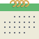
 | `import 'package:koukicons/calendar2.dart';` `KoukiconsCalendar2(), `|
| calendar3 | 

 | `import 'package:koukicons/calendar3.dart';` `KoukiconsCalendar3(), `|
| calendar4 | 
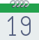
 | `import 'package:koukicons/calendar4.dart';` `KoukiconsCalendar4(), `|
| calendar5 | 
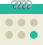
 | `import 'package:koukicons/calendar5.dart';` `KoukiconsCalendar5(), `|
| callback | 

 | `import 'package:koukicons/callback.dart';` `KoukiconsCallback(), `|
| callTransfer | 

 | `import 'package:koukicons/callTransfer.dart';` `KoukiconsCallTransfer(), `|
| camcorder | 

 | `import 'package:koukicons/camcorder.dart';` `KoukiconsCamcorder(), `|
| camcorderPro | 

 | `import 'package:koukicons/camcorderPro.dart';` `KoukiconsCamcorderPro(), `|
| camera | 

 | `import 'package:koukicons/camera.dart';` `KoukiconsCamera(), `|
| camera2 | 

 | `import 'package:koukicons/camera2.dart';` `KoukiconsCamera2(), `|
| cameraAddon | 

 | `import 'package:koukicons/cameraAddon.dart';` `KoukiconsCameraAddon(), `|
| cameraIdentification | 

 | `import 'package:koukicons/cameraIdentification.dart';` `KoukiconsCameraIdentification(), `|
| camx | 

 | `import 'package:koukicons/camx.dart';` `KoukiconsCamx(), `|
| cancel | 

 | `import 'package:koukicons/cancel.dart';` `KoukiconsCancel(), `|
| candleSticks | 

 | `import 'package:koukicons/candleSticks.dart';` `KoukiconsCandleSticks(), `|
| capacitor | 

 | `import 'package:koukicons/capacitor.dart';` `KoukiconsCapacitor(), `|
| caseX | 

 | `import 'package:koukicons/caseX.dart';` `KoukiconsCaseX(), `|
| cd | 

 | `import 'package:koukicons/cd.dart';` `KoukiconsCd(), `|
| cd2 | 

 | `import 'package:koukicons/cd2.dart';` `KoukiconsCd2(), `|
| cellPhone | 

 | `import 'package:koukicons/cellPhone.dart';` `KoukiconsCellPhone(), `|
| chargeBattery | 

 | `import 'package:koukicons/chargeBattery.dart';` `KoukiconsChargeBattery(), `|
| chargingBattery | 

 | `import 'package:koukicons/chargingBattery.dart';` `KoukiconsChargingBattery(), `|
| checklist | 

 | `import 'package:koukicons/checklist.dart';` `KoukiconsChecklist(), `|
| checkmark | 

 | `import 'package:koukicons/checkmark.dart';` `KoukiconsCheckmark(), `|
| circuit | 

 | `import 'package:koukicons/circuit.dart';` `KoukiconsCircuit(), `|
| clapperboard | 

 | `import 'package:koukicons/clapperboard.dart';` `KoukiconsClapperboard(), `|
| clearFilters | 

 | `import 'package:koukicons/clearFilters.dart';` `KoukiconsClearFilters(), `|
| clock | 

 | `import 'package:koukicons/clock.dart';` `KoukiconsClock(), `|
| clock2 | 

 | `import 'package:koukicons/clock2.dart';` `KoukiconsClock2(), `|
| clocktime | 

 | `import 'package:koukicons/clocktime.dart';` `KoukiconsClocktime(), `|
| closeUpMode | 

 | `import 'package:koukicons/closeUpMode.dart';` `KoukiconsCloseUpMode(), `|
| cloth | 

 | `import 'package:koukicons/cloth.dart';` `KoukiconsCloth(), `|
| cloud | 

 | `import 'package:koukicons/cloud.dart';` `KoukiconsCloud(), `|
| cloudDown | 

 | `import 'package:koukicons/cloudDown.dart';` `KoukiconsCloudDown(), `|
| cloudSearch | 

 | `import 'package:koukicons/cloudSearch.dart';` `KoukiconsCloudSearch(), `|
| cloudSync | 

 | `import 'package:koukicons/cloudSync.dart';` `KoukiconsCloudSync(), `|
| cloudTransfert | 

 | `import 'package:koukicons/cloudTransfert.dart';` `KoukiconsCloudTransfert(), `|
| cloudUpload | 

 | `import 'package:koukicons/cloudUpload.dart';` `KoukiconsCloudUpload(), `|
| cloudWarning | 

 | `import 'package:koukicons/cloudWarning.dart';` `KoukiconsCloudWarning(), `|
| collaboration | 

 | `import 'package:koukicons/collaboration.dart';` `KoukiconsCollaboration(), `|
| collapse | 

 | `import 'package:koukicons/collapse.dart';` `KoukiconsCollapse(), `|
| collect | 

 | `import 'package:koukicons/collect.dart';` `KoukiconsCollect(), `|
| comboChart | 

 | `import 'package:koukicons/comboChart.dart';` `KoukiconsComboChart(), `|
| command | 

 | `import 'package:koukicons/command.dart';` `KoukiconsCommand(), `|
| comments | 

 | `import 'package:koukicons/comments.dart';` `KoukiconsComments(), `|
| compactCamera | 

 | `import 'package:koukicons/compactCamera.dart';` `KoukiconsCompactCamera(), `|
| compass | 

 | `import 'package:koukicons/compass.dart';` `KoukiconsCompass(), `|
| compose | 

 | `import 'package:koukicons/compose.dart';` `KoukiconsCompose(), `|
| conferenceCall | 

 | `import 'package:koukicons/conferenceCall.dart';` `KoukiconsConferenceCall(), `|
| connectedNetwork | 

 | `import 'package:koukicons/connectedNetwork.dart';` `KoukiconsConnectedNetwork(), `|
| contacts | 

 | `import 'package:koukicons/contacts.dart';` `KoukiconsContacts(), `|
| controls1 | 
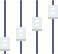
 | `import 'package:koukicons/controls1.dart';` `KoukiconsControls1(), `|
| controls10 | 

 | `import 'package:koukicons/controls10.dart';` `KoukiconsControls10(), `|
| controls2 | 
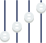
 | `import 'package:koukicons/controls2.dart';` `KoukiconsControls2(), `|
| controls3 | 

 | `import 'package:koukicons/controls3.dart';` `KoukiconsControls3(), `|
| controls4 | 
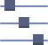
 | `import 'package:koukicons/controls4.dart';` `KoukiconsControls4(), `|
| controls5 | 

 | `import 'package:koukicons/controls5.dart';` `KoukiconsControls5(), `|
| controls6 | 
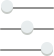
 | `import 'package:koukicons/controls6.dart';` `KoukiconsControls6(), `|
| controls7 | 
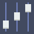
 | `import 'package:koukicons/controls7.dart';` `KoukiconsControls7(), `|
| controls8 | 

 | `import 'package:koukicons/controls8.dart';` `KoukiconsControls8(), `|
| controls9 | 

 | `import 'package:koukicons/controls9.dart';` `KoukiconsControls9(), `|
| copyleft | 

 | `import 'package:koukicons/copyleft.dart';` `KoukiconsCopyleft(), `|
| copyright | 

 | `import 'package:koukicons/copyright.dart';` `KoukiconsCopyright(), `|
| crystalOscillator | 

 | `import 'package:koukicons/crystalOscillator.dart';` `KoukiconsCrystalOscillator(), `|
| currencyExchange | 

 | `import 'package:koukicons/currencyExchange.dart';` `KoukiconsCurrencyExchange(), `|
| cursor | 

 | `import 'package:koukicons/cursor.dart';` `KoukiconsCursor(), `|
| customerSupport | 

 | `import 'package:koukicons/customerSupport.dart';` `KoukiconsCustomerSupport(), `|
| dam | 

 | `import 'package:koukicons/dam.dart';` `KoukiconsDam(), `|
| dataBackup | 

 | `import 'package:koukicons/dataBackup.dart';` `KoukiconsDataBackup(), `|
| database | 

 | `import 'package:koukicons/database.dart';` `KoukiconsDatabase(), `|
| database2 | 

 | `import 'package:koukicons/database2.dart';` `KoukiconsDatabase2(), `|
| database3 | 

 | `import 'package:koukicons/database3.dart';` `KoukiconsDatabase3(), `|
| databaseNetwork | 

 | `import 'package:koukicons/databaseNetwork.dart';` `KoukiconsDatabaseNetwork(), `|
| databaseX | 

 | `import 'package:koukicons/databaseX.dart';` `KoukiconsDatabaseX(), `|
| dataConfiguration | 

 | `import 'package:koukicons/dataConfiguration.dart';` `KoukiconsDataConfiguration(), `|
| dataEncryption | 

 | `import 'package:koukicons/dataEncryption.dart';` `KoukiconsDataEncryption(), `|
| dataProtection | 

 | `import 'package:koukicons/dataProtection.dart';` `KoukiconsDataProtection(), `|
| dataRecovery | 

 | `import 'package:koukicons/dataRecovery.dart';` `KoukiconsDataRecovery(), `|
| dataSheet | 

 | `import 'package:koukicons/dataSheet.dart';` `KoukiconsDataSheet(), `|
| debt | 

 | `import 'package:koukicons/debt.dart';` `KoukiconsDebt(), `|
| decision | 

 | `import 'package:koukicons/decision.dart';` `KoukiconsDecision(), `|
| deleteColumn | 

 | `import 'package:koukicons/deleteColumn.dart';` `KoukiconsDeleteColumn(), `|
| deleteDatabase | 

 | `import 'package:koukicons/deleteDatabase.dart';` `KoukiconsDeleteDatabase(), `|
| deleteRow | 

 | `import 'package:koukicons/deleteRow.dart';` `KoukiconsDeleteRow(), `|
| department | 

 | `import 'package:koukicons/department.dart';` `KoukiconsDepartment(), `|
| deployment | 

 | `import 'package:koukicons/deployment.dart';` `KoukiconsDeployment(), `|
| dialPad | 

 | `import 'package:koukicons/dialPad.dart';` `KoukiconsDialPad(), `|
| diamond | 

 | `import 'package:koukicons/diamond.dart';` `KoukiconsDiamond(), `|
| diploamaX | 

 | `import 'package:koukicons/diploamaX.dart';` `KoukiconsDiploamaX(), `|
| diploma | 

 | `import 'package:koukicons/diploma.dart';` `KoukiconsDiploma(), `|
| diploma1 | 

 | `import 'package:koukicons/diploma1.dart';` `KoukiconsDiploma1(), `|
| disapprove | 

 | `import 'package:koukicons/disapprove.dart';` `KoukiconsDisapprove(), `|
| disclaimer | 

 | `import 'package:koukicons/disclaimer.dart';` `KoukiconsDisclaimer(), `|
| disconnectedNetwork | 

 | `import 'package:koukicons/disconnectedNetwork.dart';` `KoukiconsDisconnectedNetwork(), `|
| dislike | 

 | `import 'package:koukicons/dislike.dart';` `KoukiconsDislike(), `|
| disliked | 

 | `import 'package:koukicons/disliked.dart';` `KoukiconsDisliked(), `|
| display | 

 | `import 'package:koukicons/display.dart';` `KoukiconsDisplay(), `|
| divide | 
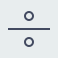
 | `import 'package:koukicons/divide.dart';` `KoukiconsDivide(), `|
| divide2 | 

 | `import 'package:koukicons/divide2.dart';` `KoukiconsDivide2(), `|
| divide3 | 

 | `import 'package:koukicons/divide3.dart';` `KoukiconsDivide3(), `|
| doc | 

 | `import 'package:koukicons/doc.dart';` `KoukiconsDoc(), `|
| docFolder | 

 | `import 'package:koukicons/docFolder.dart';` `KoukiconsDocFolder(), `|
| docFolder2 | 

 | `import 'package:koukicons/docFolder2.dart';` `KoukiconsDocFolder2(), `|
| docFolder3 | 

 | `import 'package:koukicons/docFolder3.dart';` `KoukiconsDocFolder3(), `|
| docFolder4 | 

 | `import 'package:koukicons/docFolder4.dart';` `KoukiconsDocFolder4(), `|
| document | 

 | `import 'package:koukicons/document.dart';` `KoukiconsDocument(), `|
| donate | 

 | `import 'package:koukicons/donate.dart';` `KoukiconsDonate(), `|
| doNotInhale | 

 | `import 'package:koukicons/doNotInhale.dart';` `KoukiconsDoNotInhale(), `|
| doNotInsert | 

 | `import 'package:koukicons/doNotInsert.dart';` `KoukiconsDoNotInsert(), `|
| doNotMix | 

 | `import 'package:koukicons/doNotMix.dart';` `KoukiconsDoNotMix(), `|
| doughnutChart | 

 | `import 'package:koukicons/doughnutChart.dart';` `KoukiconsDoughnutChart(), `|
| down | 

 | `import 'package:koukicons/down.dart';` `KoukiconsDown(), `|
| downLeft | 

 | `import 'package:koukicons/downLeft.dart';` `KoukiconsDownLeft(), `|
| download | 

 | `import 'package:koukicons/download.dart';` `KoukiconsDownload(), `|
| downloadFolder | 

 | `import 'package:koukicons/downloadFolder.dart';` `KoukiconsDownloadFolder(), `|
| downloadX | 

 | `import 'package:koukicons/downloadX.dart';` `KoukiconsDownloadX(), `|
| downRight | 

 | `import 'package:koukicons/downRight.dart';` `KoukiconsDownRight(), `|
| drainingBattery | 

 | `import 'package:koukicons/drainingBattery.dart';` `KoukiconsDrainingBattery(), `|
| drainingBattery2 | 

 | `import 'package:koukicons/drainingBattery2.dart';` `KoukiconsDrainingBattery2(), `|
| driverLicence | 

 | `import 'package:koukicons/driverLicence.dart';` `KoukiconsDriverLicence(), `|
| edit | 

 | `import 'package:koukicons/edit.dart';` `KoukiconsEdit(), `|
| editDoc | 

 | `import 'package:koukicons/editDoc.dart';` `KoukiconsEditDoc(), `|
| editImage | 

 | `import 'package:koukicons/editImage.dart';` `KoukiconsEditImage(), `|
| eject | 

 | `import 'package:koukicons/eject.dart';` `KoukiconsEject(), `|
| eject2 | 

 | `import 'package:koukicons/eject2.dart';` `KoukiconsEject2(), `|
| electricalSensor | 

 | `import 'package:koukicons/electricalSensor.dart';` `KoukiconsElectricalSensor(), `|
| electricalThreshold | 

 | `import 'package:koukicons/electricalThreshold.dart';` `KoukiconsElectricalThreshold(), `|
| electricity | 

 | `import 'package:koukicons/electricity.dart';` `KoukiconsElectricity(), `|
| electroDevices | 

 | `import 'package:koukicons/electroDevices.dart';` `KoukiconsElectroDevices(), `|
| electronics | 

 | `import 'package:koukicons/electronics.dart';` `KoukiconsElectronics(), `|
| employeeBadge | 

 | `import 'package:koukicons/employeeBadge.dart';` `KoukiconsEmployeeBadge(), `|
| employeeBadge2 | 

 | `import 'package:koukicons/employeeBadge2.dart';` `KoukiconsEmployeeBadge2(), `|
| employeeBadge3 | 

 | `import 'package:koukicons/employeeBadge3.dart';` `KoukiconsEmployeeBadge3(), `|
| employeeBadge4 | 

 | `import 'package:koukicons/employeeBadge4.dart';` `KoukiconsEmployeeBadge4(), `|
| emptyBattery | 

 | `import 'package:koukicons/emptyBattery.dart';` `KoukiconsEmptyBattery(), `|
| emptyFilter | 

 | `import 'package:koukicons/emptyFilter.dart';` `KoukiconsEmptyFilter(), `|
| emptyTrash | 

 | `import 'package:koukicons/emptyTrash.dart';` `KoukiconsEmptyTrash(), `|
| endCall | 

 | `import 'package:koukicons/endCall.dart';` `KoukiconsEndCall(), `|
| engineering | 

 | `import 'package:koukicons/engineering.dart';` `KoukiconsEngineering(), `|
| enter | 
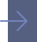
 | `import 'package:koukicons/enter.dart';` `KoukiconsEnter(), `|
| enteringHeavenAlive | 

 | `import 'package:koukicons/enteringHeavenAlive.dart';` `KoukiconsEnteringHeavenAlive(), `|
| equal | 
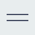
 | `import 'package:koukicons/equal.dart';` `KoukiconsEqual(), `|
| equal2 | 

 | `import 'package:koukicons/equal2.dart';` `KoukiconsEqual2(), `|
| equal3 | 

 | `import 'package:koukicons/equal3.dart';` `KoukiconsEqual3(), `|
| error | 

 | `import 'package:koukicons/error.dart';` `KoukiconsError(), `|
| eventDate | 

 | `import 'package:koukicons/eventDate.dart';` `KoukiconsEventDate(), `|
| eventDate2 | 

 | `import 'package:koukicons/eventDate2.dart';` `KoukiconsEventDate2(), `|
| exitArrow | 

 | `import 'package:koukicons/exitArrow.dart';` `KoukiconsExitArrow(), `|
| exitDoor | 

 | `import 'package:koukicons/exitDoor.dart';` `KoukiconsExitDoor(), `|
| exitDoor2 | 

 | `import 'package:koukicons/exitDoor2.dart';` `KoukiconsExitDoor2(), `|
| exitWin | 

 | `import 'package:koukicons/exitWin.dart';` `KoukiconsExitWin(), `|
| expand | 

 | `import 'package:koukicons/expand.dart';` `KoukiconsExpand(), `|
| expired | 

 | `import 'package:koukicons/expired.dart';` `KoukiconsExpired(), `|
| export | 

 | `import 'package:koukicons/export.dart';` `KoukiconsExport(), `|
| external | 

 | `import 'package:koukicons/external.dart';` `KoukiconsExternal(), `|
| factory | 

 | `import 'package:koukicons/factory.dart';` `KoukiconsFactory(), `|
| factoryBreakdown | 

 | `import 'package:koukicons/factoryBreakdown.dart';` `KoukiconsFactoryBreakdown(), `|
| faq | 

 | `import 'package:koukicons/faq.dart';` `KoukiconsFaq(), `|
| fastBack | 

 | `import 'package:koukicons/fastBack.dart';` `KoukiconsFastBack(), `|
| fastBack2 | 

 | `import 'package:koukicons/fastBack2.dart';` `KoukiconsFastBack2(), `|
| fastForward | 

 | `import 'package:koukicons/fastForward.dart';` `KoukiconsFastForward(), `|
| fastForward2 | 

 | `import 'package:koukicons/fastForward2.dart';` `KoukiconsFastForward2(), `|
| favourite | 

 | `import 'package:koukicons/favourite.dart';` `KoukiconsFavourite(), `|
| favourite2 | 

 | `import 'package:koukicons/favourite2.dart';` `KoukiconsFavourite2(), `|
| fax | 

 | `import 'package:koukicons/fax.dart';` `KoukiconsFax(), `|
| feedback | 

 | `import 'package:koukicons/feedback.dart';` `KoukiconsFeedback(), `|
| feedIn | 

 | `import 'package:koukicons/feedIn.dart';` `KoukiconsFeedIn(), `|
| file | 

 | `import 'package:koukicons/file.dart';` `KoukiconsFile(), `|
| files | 

 | `import 'package:koukicons/files.dart';` `KoukiconsFiles(), `|
| files2 | 

 | `import 'package:koukicons/files2.dart';` `KoukiconsFiles2(), `|
| filingCabinet | 

 | `import 'package:koukicons/filingCabinet.dart';` `KoukiconsFilingCabinet(), `|
| filledFilter | 

 | `import 'package:koukicons/filledFilter.dart';` `KoukiconsFilledFilter(), `|
| film | 

 | `import 'package:koukicons/film.dart';` `KoukiconsFilm(), `|
| filmReel | 

 | `import 'package:koukicons/filmReel.dart';` `KoukiconsFilmReel(), `|
| finePrint | 

 | `import 'package:koukicons/finePrint.dart';` `KoukiconsFinePrint(), `|
| fingerprint | 

 | `import 'package:koukicons/fingerprint.dart';` `KoukiconsFingerprint(), `|
| flag1 | 

 | `import 'package:koukicons/flag1.dart';` `KoukiconsFlag1(), `|
| flag2 | 

 | `import 'package:koukicons/flag2.dart';` `KoukiconsFlag2(), `|
| flag3 | 

 | `import 'package:koukicons/flag3.dart';` `KoukiconsFlag3(), `|
| flag4 | 

 | `import 'package:koukicons/flag4.dart';` `KoukiconsFlag4(), `|
| flag5 | 

 | `import 'package:koukicons/flag5.dart';` `KoukiconsFlag5(), `|
| flashAuto | 

 | `import 'package:koukicons/flashAuto.dart';` `KoukiconsFlashAuto(), `|
| flashOff | 

 | `import 'package:koukicons/flashOff.dart';` `KoukiconsFlashOff(), `|
| flashOn | 

 | `import 'package:koukicons/flashOn.dart';` `KoukiconsFlashOn(), `|
| flipboard | 

 | `import 'package:koukicons/flipboard.dart';` `KoukiconsFlipboard(), `|
| flipboard2 | 

 | `import 'package:koukicons/flipboard2.dart';` `KoukiconsFlipboard2(), `|
| flowChart | 

 | `import 'package:koukicons/flowChart.dart';` `KoukiconsFlowChart(), `|
| focus | 

 | `import 'package:koukicons/focus.dart';` `KoukiconsFocus(), `|
| folder | 

 | `import 'package:koukicons/folder.dart';` `KoukiconsFolder(), `|
| folder2 | 

 | `import 'package:koukicons/folder2.dart';` `KoukiconsFolder2(), `|
| folder3 | 

 | `import 'package:koukicons/folder3.dart';` `KoukiconsFolder3(), `|
| folder4 | 

 | `import 'package:koukicons/folder4.dart';` `KoukiconsFolder4(), `|
| folder5 | 

 | `import 'package:koukicons/folder5.dart';` `KoukiconsFolder5(), `|
| folder6 | 

 | `import 'package:koukicons/folder6.dart';` `KoukiconsFolder6(), `|
| folder7 | 

 | `import 'package:koukicons/folder7.dart';` `KoukiconsFolder7(), `|
| folderX | 

 | `import 'package:koukicons/folderX.dart';` `KoukiconsFolderX(), `|
| forbidden | 

 | `import 'package:koukicons/forbidden.dart';` `KoukiconsForbidden(), `|
| forward | 

 | `import 'package:koukicons/forward.dart';` `KoukiconsForward(), `|
| forward2 | 

 | `import 'package:koukicons/forward2.dart';` `KoukiconsForward2(), `|
| frame | 

 | `import 'package:koukicons/frame.dart';` `KoukiconsFrame(), `|
| framePic | 

 | `import 'package:koukicons/framePic.dart';` `KoukiconsFramePic(), `|
| fullBattery | 

 | `import 'package:koukicons/fullBattery.dart';` `KoukiconsFullBattery(), `|
| fullBattery2 | 

 | `import 'package:koukicons/fullBattery2.dart';` `KoukiconsFullBattery2(), `|
| fullBattery3 | 

 | `import 'package:koukicons/fullBattery3.dart';` `KoukiconsFullBattery3(), `|
| fullTrash | 

 | `import 'package:koukicons/fullTrash.dart';` `KoukiconsFullTrash(), `|
| funnel | 

 | `import 'package:koukicons/funnel.dart';` `KoukiconsFunnel(), `|
| gallery | 

 | `import 'package:koukicons/gallery.dart';` `KoukiconsGallery(), `|
| galleryX | 

 | `import 'package:koukicons/galleryX.dart';` `KoukiconsGalleryX(), `|
| genealogy | 
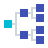
 | `import 'package:koukicons/genealogy.dart';` `KoukiconsGenealogy(), `|
| genericSortingAsc | 

 | `import 'package:koukicons/genericSortingAsc.dart';` `KoukiconsGenericSortingAsc(), `|
| genericSortingDesc | 

 | `import 'package:koukicons/genericSortingDesc.dart';` `KoukiconsGenericSortingDesc(), `|
| gift | 

 | `import 'package:koukicons/gift.dart';` `KoukiconsGift(), `|
| glasses | 

 | `import 'package:koukicons/glasses.dart';` `KoukiconsGlasses(), `|
| globe | 

 | `import 'package:koukicons/globe.dart';` `KoukiconsGlobe(), `|
| goodDecision | 

 | `import 'package:koukicons/goodDecision.dart';` `KoukiconsGoodDecision(), `|
| graduationCap | 

 | `import 'package:koukicons/graduationCap.dart';` `KoukiconsGraduationCap(), `|
| grid | 

 | `import 'package:koukicons/grid.dart';` `KoukiconsGrid(), `|
| halfBattery | 

 | `import 'package:koukicons/halfBattery.dart';` `KoukiconsHalfBattery(), `|
| halfBattery2 | 

 | `import 'package:koukicons/halfBattery2.dart';` `KoukiconsHalfBattery2(), `|
| hambMenu | 

 | `import 'package:koukicons/hambMenu.dart';` `KoukiconsHambMenu(), `|
| hambMenu2 | 

 | `import 'package:koukicons/hambMenu2.dart';` `KoukiconsHambMenu2(), `|
| headset | 

 | `import 'package:koukicons/headset.dart';` `KoukiconsHeadset(), `|
| heatMap | 

 | `import 'package:koukicons/heatMap.dart';` `KoukiconsHeatMap(), `|
| help | 

 | `import 'package:koukicons/help.dart';` `KoukiconsHelp(), `|
| help2 | 

 | `import 'package:koukicons/help2.dart';` `KoukiconsHelp2(), `|
| hide | 

 | `import 'package:koukicons/hide.dart';` `KoukiconsHide(), `|
| highBattery | 

 | `import 'package:koukicons/highBattery.dart';` `KoukiconsHighBattery(), `|
| highPriority | 

 | `import 'package:koukicons/highPriority.dart';` `KoukiconsHighPriority(), `|
| highVol | 

 | `import 'package:koukicons/highVol.dart';` `KoukiconsHighVol(), `|
| highVol2 | 

 | `import 'package:koukicons/highVol2.dart';` `KoukiconsHighVol2(), `|
| home | 

 | `import 'package:koukicons/home.dart';` `KoukiconsHome(), `|
| home1 | 

 | `import 'package:koukicons/home1.dart';` `KoukiconsHome1(), `|
| home2 | 

 | `import 'package:koukicons/home2.dart';` `KoukiconsHome2(), `|
| home3 | 

 | `import 'package:koukicons/home3.dart';` `KoukiconsHome3(), `|
| home4 | 

 | `import 'package:koukicons/home4.dart';` `KoukiconsHome4(), `|
| icons8Cup | 

 | `import 'package:koukicons/icons8Cup.dart';` `KoukiconsIcons8Cup(), `|
| id | 

 | `import 'package:koukicons/id.dart';` `KoukiconsId(), `|
| idea | 

 | `import 'package:koukicons/idea.dart';` `KoukiconsIdea(), `|
| ideaX | 

 | `import 'package:koukicons/ideaX.dart';` `KoukiconsIdeaX(), `|
| imageFile | 

 | `import 'package:koukicons/imageFile.dart';` `KoukiconsImageFile(), `|
| import | 

 | `import 'package:koukicons/import.dart';` `KoukiconsImport(), `|
| importantArchive | 

 | `import 'package:koukicons/importantArchive.dart';` `KoukiconsImportantArchive(), `|
| infinity | 

 | `import 'package:koukicons/infinity.dart';` `KoukiconsInfinity(), `|
| info | 

 | `import 'package:koukicons/info.dart';` `KoukiconsInfo(), `|
| inspection | 

 | `import 'package:koukicons/inspection.dart';` `KoukiconsInspection(), `|
| integratedWebcam | 

 | `import 'package:koukicons/integratedWebcam.dart';` `KoukiconsIntegratedWebcam(), `|
| internal | 

 | `import 'package:koukicons/internal.dart';` `KoukiconsInternal(), `|
| internet | 

 | `import 'package:koukicons/internet.dart';` `KoukiconsInternet(), `|
| inTransit | 

 | `import 'package:koukicons/inTransit.dart';` `KoukiconsInTransit(), `|
| invite | 

 | `import 'package:koukicons/invite.dart';` `KoukiconsInvite(), `|
| ipad | 

 | `import 'package:koukicons/ipad.dart';` `KoukiconsIpad(), `|
| iphone | 

 | `import 'package:koukicons/iphone.dart';` `KoukiconsIphone(), `|
| key1 | 

 | `import 'package:koukicons/key1.dart';` `KoukiconsKey1(), `|
| key2 | 

 | `import 'package:koukicons/key2.dart';` `KoukiconsKey2(), `|
| kindle | 

 | `import 'package:koukicons/kindle.dart';` `KoukiconsKindle(), `|
| knob | 

 | `import 'package:koukicons/knob.dart';` `KoukiconsKnob(), `|
| knob2 | 

 | `import 'package:koukicons/knob2.dart';` `KoukiconsKnob2(), `|
| lamp | 

 | `import 'package:koukicons/lamp.dart';` `KoukiconsLamp(), `|
| lan | 

 | `import 'package:koukicons/lan.dart';` `KoukiconsLan(), `|
| landscape | 

 | `import 'package:koukicons/landscape.dart';` `KoukiconsLandscape(), `|
| layers | 

 | `import 'package:koukicons/layers.dart';` `KoukiconsLayers(), `|
| layers2 | 

 | `import 'package:koukicons/layers2.dart';` `KoukiconsLayers2(), `|
| leakingBattery | 

 | `import 'package:koukicons/leakingBattery.dart';` `KoukiconsLeakingBattery(), `|
| leave | 

 | `import 'package:koukicons/leave.dart';` `KoukiconsLeave(), `|
| left | 

 | `import 'package:koukicons/left.dart';` `KoukiconsLeft(), `|
| leftDown | 

 | `import 'package:koukicons/leftDown.dart';` `KoukiconsLeftDown(), `|
| leftDown2 | 

 | `import 'package:koukicons/leftDown2.dart';` `KoukiconsLeftDown2(), `|
| leftUp | 

 | `import 'package:koukicons/leftUp.dart';` `KoukiconsLeftUp(), `|
| leftUp2 | 

 | `import 'package:koukicons/leftUp2.dart';` `KoukiconsLeftUp2(), `|
| library | 

 | `import 'package:koukicons/library.dart';` `KoukiconsLibrary(), `|
| lightAtTheEndOfTunnel | 

 | `import 'package:koukicons/lightAtTheEndOfTunnel.dart';` `KoukiconsLightAtTheEndOfTunnel(), `|
| like | 

 | `import 'package:koukicons/like.dart';` `KoukiconsLike(), `|
| like2 | 

 | `import 'package:koukicons/like2.dart';` `KoukiconsLike2(), `|
| likePlaceholder | 

 | `import 'package:koukicons/likePlaceholder.dart';` `KoukiconsLikePlaceholder(), `|
| likeX | 

 | `import 'package:koukicons/likeX.dart';` `KoukiconsLikeX(), `|
| lineChart | 

 | `import 'package:koukicons/lineChart.dart';` `KoukiconsLineChart(), `|
| link | 

 | `import 'package:koukicons/link.dart';` `KoukiconsLink(), `|
| linkGreen | 

 | `import 'package:koukicons/linkGreen.dart';` `KoukiconsLinkGreen(), `|
| list | 

 | `import 'package:koukicons/list.dart';` `KoukiconsList(), `|
| liveNews | 

 | `import 'package:koukicons/liveNews.dart';` `KoukiconsLiveNews(), `|
| location | 

 | `import 'package:koukicons/location.dart';` `KoukiconsLocation(), `|
| location2 | 

 | `import 'package:koukicons/location2.dart';` `KoukiconsLocation2(), `|
| location3 | 

 | `import 'package:koukicons/location3.dart';` `KoukiconsLocation3(), `|
| locationArea | 

 | `import 'package:koukicons/locationArea.dart';` `KoukiconsLocationArea(), `|
| locationPin | 

 | `import 'package:koukicons/locationPin.dart';` `KoukiconsLocationPin(), `|
| lock | 

 | `import 'package:koukicons/lock.dart';` `KoukiconsLock(), `|
| lock2 | 

 | `import 'package:koukicons/lock2.dart';` `KoukiconsLock2(), `|
| lock3 | 

 | `import 'package:koukicons/lock3.dart';` `KoukiconsLock3(), `|
| lock4 | 

 | `import 'package:koukicons/lock4.dart';` `KoukiconsLock4(), `|
| locked | 

 | `import 'package:koukicons/locked.dart';` `KoukiconsLocked(), `|
| lockFolder | 

 | `import 'package:koukicons/lockFolder.dart';` `KoukiconsLockFolder(), `|
| lockLandscape | 

 | `import 'package:koukicons/lockLandscape.dart';` `KoukiconsLockLandscape(), `|
| lockOri | 

 | `import 'package:koukicons/lockOri.dart';` `KoukiconsLockOri(), `|
| lockPortrait | 

 | `import 'package:koukicons/lockPortrait.dart';` `KoukiconsLockPortrait(), `|
| lockX | 

 | `import 'package:koukicons/lockX.dart';` `KoukiconsLockX(), `|
| lowBattery | 

 | `import 'package:koukicons/lowBattery.dart';` `KoukiconsLowBattery(), `|
| lowBattery2 | 

 | `import 'package:koukicons/lowBattery2.dart';` `KoukiconsLowBattery2(), `|
| lowBattery3 | 

 | `import 'package:koukicons/lowBattery3.dart';` `KoukiconsLowBattery3(), `|
| lowPriority | 

 | `import 'package:koukicons/lowPriority.dart';` `KoukiconsLowPriority(), `|
| lowVol | 

 | `import 'package:koukicons/lowVol.dart';` `KoukiconsLowVol(), `|
| lowVol2 | 

 | `import 'package:koukicons/lowVol2.dart';` `KoukiconsLowVol2(), `|
| magic | 

 | `import 'package:koukicons/magic.dart';` `KoukiconsMagic(), `|
| magnet1 | 

 | `import 'package:koukicons/magnet1.dart';` `KoukiconsMagnet1(), `|
| magnet2 | 

 | `import 'package:koukicons/magnet2.dart';` `KoukiconsMagnet2(), `|
| magnet3 | 

 | `import 'package:koukicons/magnet3.dart';` `KoukiconsMagnet3(), `|
| makeDecision | 

 | `import 'package:koukicons/makeDecision.dart';` `KoukiconsMakeDecision(), `|
| manager | 

 | `import 'package:koukicons/manager.dart';` `KoukiconsManager(), `|
| map | 

 | `import 'package:koukicons/map.dart';` `KoukiconsMap(), `|
| map2 | 

 | `import 'package:koukicons/map2.dart';` `KoukiconsMap2(), `|
| mapLocation | 

 | `import 'package:koukicons/mapLocation.dart';` `KoukiconsMapLocation(), `|
| mediumPriority | 

 | `import 'package:koukicons/mediumPriority.dart';` `KoukiconsMediumPriority(), `|
| medVol | 

 | `import 'package:koukicons/medVol.dart';` `KoukiconsMedVol(), `|
| medVol2 | 

 | `import 'package:koukicons/medVol2.dart';` `KoukiconsMedVol2(), `|
| menu | 

 | `import 'package:koukicons/menu.dart';` `KoukiconsMenu(), `|
| menu2 | 

 | `import 'package:koukicons/menu2.dart';` `KoukiconsMenu2(), `|
| menuX | 

 | `import 'package:koukicons/menuX.dart';` `KoukiconsMenuX(), `|
| middleBattery | 

 | `import 'package:koukicons/middleBattery.dart';` `KoukiconsMiddleBattery(), `|
| mindMap | 

 | `import 'package:koukicons/mindMap.dart';` `KoukiconsMindMap(), `|
| minus | 

 | `import 'package:koukicons/minus.dart';` `KoukiconsMinus(), `|
| missedCall | 

 | `import 'package:koukicons/missedCall.dart';` `KoukiconsMissedCall(), `|
| mms | 

 | `import 'package:koukicons/mms.dart';` `KoukiconsMms(), `|
| moneyTransfer | 

 | `import 'package:koukicons/moneyTransfer.dart';` `KoukiconsMoneyTransfer(), `|
| more | 

 | `import 'package:koukicons/more.dart';` `KoukiconsMore(), `|
| more2 | 

 | `import 'package:koukicons/more2.dart';` `KoukiconsMore2(), `|
| more3 | 

 | `import 'package:koukicons/more3.dart';` `KoukiconsMore3(), `|
| movie | 

 | `import 'package:koukicons/movie.dart';` `KoukiconsMovie(), `|
| movie2 | 

 | `import 'package:koukicons/movie2.dart';` `KoukiconsMovie2(), `|
| movieCam | 

 | `import 'package:koukicons/movieCam.dart';` `KoukiconsMovieCam(), `|
| multipleCameras | 

 | `import 'package:koukicons/multipleCameras.dart';` `KoukiconsMultipleCameras(), `|
| multipleDevices | 

 | `import 'package:koukicons/multipleDevices.dart';` `KoukiconsMultipleDevices(), `|
| multipleInputs | 

 | `import 'package:koukicons/multipleInputs.dart';` `KoukiconsMultipleInputs(), `|
| multipleSmartphones | 

 | `import 'package:koukicons/multipleSmartphones.dart';` `KoukiconsMultipleSmartphones(), `|
| multiply | 

 | `import 'package:koukicons/multiply.dart';` `KoukiconsMultiply(), `|
| multiply3 | 

 | `import 'package:koukicons/multiply3.dart';` `KoukiconsMultiply3(), `|
| music | 

 | `import 'package:koukicons/music.dart';` `KoukiconsMusic(), `|
| musical | 

 | `import 'package:koukicons/musical.dart';` `KoukiconsMusical(), `|
| musicX | 

 | `import 'package:koukicons/musicX.dart';` `KoukiconsMusicX(), `|
| mute | 

 | `import 'package:koukicons/mute.dart';` `KoukiconsMute(), `|
| mute2 | 

 | `import 'package:koukicons/mute2.dart';` `KoukiconsMute2(), `|
| mute3 | 

 | `import 'package:koukicons/mute3.dart';` `KoukiconsMute3(), `|
| navigation | 

 | `import 'package:koukicons/navigation.dart';` `KoukiconsNavigation(), `|
| navigator | 

 | `import 'package:koukicons/navigator.dart';` `KoukiconsNavigator(), `|
| negativeDynamic | 

 | `import 'package:koukicons/negativeDynamic.dart';` `KoukiconsNegativeDynamic(), `|
| network | 

 | `import 'package:koukicons/network.dart';` `KoukiconsNetwork(), `|
| network2 | 

 | `import 'package:koukicons/network2.dart';` `KoukiconsNetwork2(), `|
| neutralDecision | 

 | `import 'package:koukicons/neutralDecision.dart';` `KoukiconsNeutralDecision(), `|
| neutralTrading | 

 | `import 'package:koukicons/neutralTrading.dart';` `KoukiconsNeutralTrading(), `|
| news | 

 | `import 'package:koukicons/news.dart';` `KoukiconsNews(), `|
| newspaper | 

 | `import 'package:koukicons/newspaper.dart';` `KoukiconsNewspaper(), `|
| next | 

 | `import 'package:koukicons/next.dart';` `KoukiconsNext(), `|
| nightLandscape | 

 | `import 'package:koukicons/nightLandscape.dart';` `KoukiconsNightLandscape(), `|
| nightPortrait | 

 | `import 'package:koukicons/nightPortrait.dart';` `KoukiconsNightPortrait(), `|
| noIdea | 

 | `import 'package:koukicons/noIdea.dart';` `KoukiconsNoIdea(), `|
| nook | 

 | `import 'package:koukicons/nook.dart';` `KoukiconsNook(), `|
| note | 
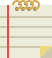
 | `import 'package:koukicons/note.dart';` `KoukiconsNote(), `|
| notebook | 

 | `import 'package:koukicons/notebook.dart';` `KoukiconsNotebook(), `|
| notebook1 | 

 | `import 'package:koukicons/notebook1.dart';` `KoukiconsNotebook1(), `|
| notebook2 | 

 | `import 'package:koukicons/notebook2.dart';` `KoukiconsNotebook2(), `|
| notebook3 | 
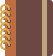
 | `import 'package:koukicons/notebook3.dart';` `KoukiconsNotebook3(), `|
| notif | 

 | `import 'package:koukicons/notif.dart';` `KoukiconsNotif(), `|
| noVideo | 

 | `import 'package:koukicons/noVideo.dart';` `KoukiconsNoVideo(), `|
| numericalSorting12 | 
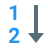
 | `import 'package:koukicons/numericalSorting12.dart';` `KoukiconsNumericalSorting12(), `|
| numericalSorting21 | 
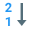
 | `import 'package:koukicons/numericalSorting21.dart';` `KoukiconsNumericalSorting21(), `|
| off | 

 | `import 'package:koukicons/off.dart';` `KoukiconsOff(), `|
| offTrig | 

 | `import 'package:koukicons/offTrig.dart';` `KoukiconsOffTrig(), `|
| offTrig2 | 

 | `import 'package:koukicons/offTrig2.dart';` `KoukiconsOffTrig2(), `|
| ok | 

 | `import 'package:koukicons/ok.dart';` `KoukiconsOk(), `|
| oldTimeCamera | 

 | `import 'package:koukicons/oldTimeCamera.dart';` `KoukiconsOldTimeCamera(), `|
| on | 

 | `import 'package:koukicons/on.dart';` `KoukiconsOn(), `|
| onlineSupport | 

 | `import 'package:koukicons/onlineSupport.dart';` `KoukiconsOnlineSupport(), `|
| onOff | 

 | `import 'package:koukicons/onOff.dart';` `KoukiconsOnOff(), `|
| onOffSwitch | 

 | `import 'package:koukicons/onOffSwitch.dart';` `KoukiconsOnOffSwitch(), `|
| onTrig | 

 | `import 'package:koukicons/onTrig.dart';` `KoukiconsOnTrig(), `|
| onTrig2 | 

 | `import 'package:koukicons/onTrig2.dart';` `KoukiconsOnTrig2(), `|
| openedFolder | 

 | `import 'package:koukicons/openedFolder.dart';` `KoukiconsOpenedFolder(), `|
| openFolder | 

 | `import 'package:koukicons/openFolder.dart';` `KoukiconsOpenFolder(), `|
| openFolder2 | 

 | `import 'package:koukicons/openFolder2.dart';` `KoukiconsOpenFolder2(), `|
| organization | 

 | `import 'package:koukicons/organization.dart';` `KoukiconsOrganization(), `|
| orgUnit | 

 | `import 'package:koukicons/orgUnit.dart';` `KoukiconsOrgUnit(), `|
| overtime | 

 | `import 'package:koukicons/overtime.dart';` `KoukiconsOvertime(), `|
| package | 

 | `import 'package:koukicons/package.dart';` `KoukiconsPackage(), `|
| paid | 

 | `import 'package:koukicons/paid.dart';` `KoukiconsPaid(), `|
| panorama | 

 | `import 'package:koukicons/panorama.dart';` `KoukiconsPanorama(), `|
| parallelTasks | 

 | `import 'package:koukicons/parallelTasks.dart';` `KoukiconsParallelTasks(), `|
| pause | 

 | `import 'package:koukicons/pause.dart';` `KoukiconsPause(), `|
| pause2 | 

 | `import 'package:koukicons/pause2.dart';` `KoukiconsPause2(), `|
| percent | 

 | `import 'package:koukicons/percent.dart';` `KoukiconsPercent(), `|
| percent2 | 

 | `import 'package:koukicons/percent2.dart';` `KoukiconsPercent2(), `|
| perspective | 

 | `import 'package:koukicons/perspective.dart';` `KoukiconsPerspective(), `|
| phone | 

 | `import 'package:koukicons/phone.dart';` `KoukiconsPhone(), `|
| phoneAndroid | 

 | `import 'package:koukicons/phoneAndroid.dart';` `KoukiconsPhoneAndroid(), `|
| phoneApps | 

 | `import 'package:koukicons/phoneApps.dart';` `KoukiconsPhoneApps(), `|
| phoneChat | 

 | `import 'package:koukicons/phoneChat.dart';` `KoukiconsPhoneChat(), `|
| phoneDown | 

 | `import 'package:koukicons/phoneDown.dart';` `KoukiconsPhoneDown(), `|
| phoneMessage | 

 | `import 'package:koukicons/phoneMessage.dart';` `KoukiconsPhoneMessage(), `|
| phoneProfile | 

 | `import 'package:koukicons/phoneProfile.dart';` `KoukiconsPhoneProfile(), `|
| phoneUp | 

 | `import 'package:koukicons/phoneUp.dart';` `KoukiconsPhoneUp(), `|
| phoneVibrate | 

 | `import 'package:koukicons/phoneVibrate.dart';` `KoukiconsPhoneVibrate(), `|
| photoReel | 

 | `import 'package:koukicons/photoReel.dart';` `KoukiconsPhotoReel(), `|
| pic | 

 | `import 'package:koukicons/pic.dart';` `KoukiconsPic(), `|
| pic2 | 

 | `import 'package:koukicons/pic2.dart';` `KoukiconsPic2(), `|
| picture | 

 | `import 'package:koukicons/picture.dart';` `KoukiconsPicture(), `|
| pieChart | 

 | `import 'package:koukicons/pieChart.dart';` `KoukiconsPieChart(), `|
| pin | 

 | `import 'package:koukicons/pin.dart';` `KoukiconsPin(), `|
| planner | 

 | `import 'package:koukicons/planner.dart';` `KoukiconsPlanner(), `|
| play | 

 | `import 'package:koukicons/play.dart';` `KoukiconsPlay(), `|
| play2 | 

 | `import 'package:koukicons/play2.dart';` `KoukiconsPlay2(), `|
| plus | 

 | `import 'package:koukicons/plus.dart';` `KoukiconsPlus(), `|
| podiumWithAudience | 

 | `import 'package:koukicons/podiumWithAudience.dart';` `KoukiconsPodiumWithAudience(), `|
| podiumWithoutSpeaker | 

 | `import 'package:koukicons/podiumWithoutSpeaker.dart';` `KoukiconsPodiumWithoutSpeaker(), `|
| podiumWithSpeaker | 

 | `import 'package:koukicons/podiumWithSpeaker.dart';` `KoukiconsPodiumWithSpeaker(), `|
| portraitMode | 

 | `import 'package:koukicons/portraitMode.dart';` `KoukiconsPortraitMode(), `|
| positiveDynamic | 

 | `import 'package:koukicons/positiveDynamic.dart';` `KoukiconsPositiveDynamic(), `|
| previous | 

 | `import 'package:koukicons/previous.dart';` `KoukiconsPrevious(), `|
| priceTag | 

 | `import 'package:koukicons/priceTag.dart';` `KoukiconsPriceTag(), `|
| print | 

 | `import 'package:koukicons/print.dart';` `KoukiconsPrint(), `|
| printer | 

 | `import 'package:koukicons/printer.dart';` `KoukiconsPrinter(), `|
| privacy | 

 | `import 'package:koukicons/privacy.dart';` `KoukiconsPrivacy(), `|
| privacyX | 

 | `import 'package:koukicons/privacyX.dart';` `KoukiconsPrivacyX(), `|
| process | 

 | `import 'package:koukicons/process.dart';` `KoukiconsProcess(), `|
| profile | 

 | `import 'package:koukicons/profile.dart';` `KoukiconsProfile(), `|
| profile2 | 

 | `import 'package:koukicons/profile2.dart';` `KoukiconsProfile2(), `|
| profile3 | 

 | `import 'package:koukicons/profile3.dart';` `KoukiconsProfile3(), `|
| profile4 | 

 | `import 'package:koukicons/profile4.dart';` `KoukiconsProfile4(), `|
| profilex | 

 | `import 'package:koukicons/profilex.dart';` `KoukiconsProfilex(), `|
| profiley | 

 | `import 'package:koukicons/profiley.dart';` `KoukiconsProfiley(), `|
| promote | 

 | `import 'package:koukicons/promote.dart';` `KoukiconsPromote(), `|
| promote2 | 

 | `import 'package:koukicons/promote2.dart';` `KoukiconsPromote2(), `|
| puzzle | 

 | `import 'package:koukicons/puzzle.dart';` `KoukiconsPuzzle(), `|
| questions | 

 | `import 'package:koukicons/questions.dart';` `KoukiconsQuestions(), `|
| radar | 

 | `import 'package:koukicons/radar.dart';` `KoukiconsRadar(), `|
| radarPlot | 

 | `import 'package:koukicons/radarPlot.dart';` `KoukiconsRadarPlot(), `|
| rating | 

 | `import 'package:koukicons/rating.dart';` `KoukiconsRating(), `|
| ratings | 

 | `import 'package:koukicons/ratings.dart';` `KoukiconsRatings(), `|
| reading | 

 | `import 'package:koukicons/reading.dart';` `KoukiconsReading(), `|
| readingEbook | 

 | `import 'package:koukicons/readingEbook.dart';` `KoukiconsReadingEbook(), `|
| readX | 

 | `import 'package:koukicons/readX.dart';` `KoukiconsReadX(), `|
| receive | 

 | `import 'package:koukicons/receive.dart';` `KoukiconsReceive(), `|
| record | 

 | `import 'package:koukicons/record.dart';` `KoukiconsRecord(), `|
| redo | 

 | `import 'package:koukicons/redo.dart';` `KoukiconsRedo(), `|
| refresh | 

 | `import 'package:koukicons/refresh.dart';` `KoukiconsRefresh(), `|
| registeredTrademark | 

 | `import 'package:koukicons/registeredTrademark.dart';` `KoukiconsRegisteredTrademark(), `|
| removeImage | 

 | `import 'package:koukicons/removeImage.dart';` `KoukiconsRemoveImage(), `|
| repeat | 

 | `import 'package:koukicons/repeat.dart';` `KoukiconsRepeat(), `|
| repeat2 | 

 | `import 'package:koukicons/repeat2.dart';` `KoukiconsRepeat2(), `|
| report | 

 | `import 'package:koukicons/report.dart';` `KoukiconsReport(), `|
| restart | 

 | `import 'package:koukicons/restart.dart';` `KoukiconsRestart(), `|
| resumee | 

 | `import 'package:koukicons/resumee.dart';` `KoukiconsResumee(), `|
| reuse | 

 | `import 'package:koukicons/reuse.dart';` `KoukiconsReuse(), `|
| right | 

 | `import 'package:koukicons/right.dart';` `KoukiconsRight(), `|
| rightDown | 

 | `import 'package:koukicons/rightDown.dart';` `KoukiconsRightDown(), `|
| rightDown2 | 

 | `import 'package:koukicons/rightDown2.dart';` `KoukiconsRightDown2(), `|
| rightUp | 

 | `import 'package:koukicons/rightUp.dart';` `KoukiconsRightUp(), `|
| rightUp2 | 

 | `import 'package:koukicons/rightUp2.dart';` `KoukiconsRightUp2(), `|
| ringing | 

 | `import 'package:koukicons/ringing.dart';` `KoukiconsRinging(), `|
| ringing2 | 

 | `import 'package:koukicons/ringing2.dart';` `KoukiconsRinging2(), `|
| roadmap | 

 | `import 'package:koukicons/roadmap.dart';` `KoukiconsRoadmap(), `|
| rotateCamera | 

 | `import 'package:koukicons/rotateCamera.dart';` `KoukiconsRotateCamera(), `|
| rotateLand | 

 | `import 'package:koukicons/rotateLand.dart';` `KoukiconsRotateLand(), `|
| rotatePort | 

 | `import 'package:koukicons/rotatePort.dart';` `KoukiconsRotatePort(), `|
| rotateToLandscape | 

 | `import 'package:koukicons/rotateToLandscape.dart';` `KoukiconsRotateToLandscape(), `|
| rotateToPortrait | 

 | `import 'package:koukicons/rotateToPortrait.dart';` `KoukiconsRotateToPortrait(), `|
| ruler | 

 | `import 'package:koukicons/ruler.dart';` `KoukiconsRuler(), `|
| rules | 

 | `import 'package:koukicons/rules.dart';` `KoukiconsRules(), `|
| safe | 

 | `import 'package:koukicons/safe.dart';` `KoukiconsSafe(), `|
| safety | 

 | `import 'package:koukicons/safety.dart';` `KoukiconsSafety(), `|
| salesPerformance | 

 | `import 'package:koukicons/salesPerformance.dart';` `KoukiconsSalesPerformance(), `|
| save | 

 | `import 'package:koukicons/save.dart';` `KoukiconsSave(), `|
| scatterPlot | 

 | `import 'package:koukicons/scatterPlot.dart';` `KoukiconsScatterPlot(), `|
| search | 

 | `import 'package:koukicons/search.dart';` `KoukiconsSearch(), `|
| search1 | 

 | `import 'package:koukicons/search1.dart';` `KoukiconsSearch1(), `|
| search2 | 

 | `import 'package:koukicons/search2.dart';` `KoukiconsSearch2(), `|
| searchFile | 

 | `import 'package:koukicons/searchFile.dart';` `KoukiconsSearchFile(), `|
| searchPhone | 

 | `import 'package:koukicons/searchPhone.dart';` `KoukiconsSearchPhone(), `|
| searchX | 

 | `import 'package:koukicons/searchX.dart';` `KoukiconsSearchX(), `|
| selectTab | 

 | `import 'package:koukicons/selectTab.dart';` `KoukiconsSelectTab(), `|
| selectWin | 

 | `import 'package:koukicons/selectWin.dart';` `KoukiconsSelectWin(), `|
| selectWin2 | 

 | `import 'package:koukicons/selectWin2.dart';` `KoukiconsSelectWin2(), `|
| selfie | 

 | `import 'package:koukicons/selfie.dart';` `KoukiconsSelfie(), `|
| selfServiceKiosk | 

 | `import 'package:koukicons/selfServiceKiosk.dart';` `KoukiconsSelfServiceKiosk(), `|
| send | 

 | `import 'package:koukicons/send.dart';` `KoukiconsSend(), `|
| send2 | 

 | `import 'package:koukicons/send2.dart';` `KoukiconsSend2(), `|
| send3 | 

 | `import 'package:koukicons/send3.dart';` `KoukiconsSend3(), `|
| serialTasks | 

 | `import 'package:koukicons/serialTasks.dart';` `KoukiconsSerialTasks(), `|
| serviceMark | 

 | `import 'package:koukicons/serviceMark.dart';` `KoukiconsServiceMark(), `|
| services | 

 | `import 'package:koukicons/services.dart';` `KoukiconsServices(), `|
| settings | 

 | `import 'package:koukicons/settings.dart';` `KoukiconsSettings(), `|
| settings1 | 

 | `import 'package:koukicons/settings1.dart';` `KoukiconsSettings1(), `|
| settings10 | 

 | `import 'package:koukicons/settings10.dart';` `KoukiconsSettings10(), `|
| settings2 | 

 | `import 'package:koukicons/settings2.dart';` `KoukiconsSettings2(), `|
| settings3 | 

 | `import 'package:koukicons/settings3.dart';` `KoukiconsSettings3(), `|
| settings4 | 

 | `import 'package:koukicons/settings4.dart';` `KoukiconsSettings4(), `|
| settings5 | 

 | `import 'package:koukicons/settings5.dart';` `KoukiconsSettings5(), `|
| settings6 | 

 | `import 'package:koukicons/settings6.dart';` `KoukiconsSettings6(), `|
| settings7 | 

 | `import 'package:koukicons/settings7.dart';` `KoukiconsSettings7(), `|
| settings8 | 

 | `import 'package:koukicons/settings8.dart';` `KoukiconsSettings8(), `|
| settings9 | 

 | `import 'package:koukicons/settings9.dart';` `KoukiconsSettings9(), `|
| share | 

 | `import 'package:koukicons/share.dart';` `KoukiconsShare(), `|
| share1 | 

 | `import 'package:koukicons/share1.dart';` `KoukiconsShare1(), `|
| share2 | 

 | `import 'package:koukicons/share2.dart';` `KoukiconsShare2(), `|
| share3 | 

 | `import 'package:koukicons/share3.dart';` `KoukiconsShare3(), `|
| shipped | 

 | `import 'package:koukicons/shipped.dart';` `KoukiconsShipped(), `|
| shop | 

 | `import 'package:koukicons/shop.dart';` `KoukiconsShop(), `|
| shuffle | 

 | `import 'package:koukicons/shuffle.dart';` `KoukiconsShuffle(), `|
| shuffle2 | 

 | `import 'package:koukicons/shuffle2.dart';` `KoukiconsShuffle2(), `|
| shutdown | 

 | `import 'package:koukicons/shutdown.dart';` `KoukiconsShutdown(), `|
| sign | 

 | `import 'package:koukicons/sign.dart';` `KoukiconsSign(), `|
| signature | 

 | `import 'package:koukicons/signature.dart';` `KoukiconsSignature(), `|
| signpost | 

 | `import 'package:koukicons/signpost.dart';` `KoukiconsSignpost(), `|
| silent | 

 | `import 'package:koukicons/silent.dart';` `KoukiconsSilent(), `|
| silent2 | 

 | `import 'package:koukicons/silent2.dart';` `KoukiconsSilent2(), `|
| simCard | 

 | `import 'package:koukicons/simCard.dart';` `KoukiconsSimCard(), `|
| simCardChip | 

 | `import 'package:koukicons/simCardChip.dart';` `KoukiconsSimCardChip(), `|
| siri | 

 | `import 'package:koukicons/siri.dart';` `KoukiconsSiri(), `|
| slrBackSide | 

 | `import 'package:koukicons/slrBackSide.dart';` `KoukiconsSlrBackSide(), `|
| smartphoneTablet | 

 | `import 'package:koukicons/smartphoneTablet.dart';` `KoukiconsSmartphoneTablet(), `|
| sms | 

 | `import 'package:koukicons/sms.dart';` `KoukiconsSms(), `|
| soundRecordingCopyright | 

 | `import 'package:koukicons/soundRecordingCopyright.dart';` `KoukiconsSoundRecordingCopyright(), `|
| speaker | 

 | `import 'package:koukicons/speaker.dart';` `KoukiconsSpeaker(), `|
| speed | 

 | `import 'package:koukicons/speed.dart';` `KoukiconsSpeed(), `|
| sportsMode | 

 | `import 'package:koukicons/sportsMode.dart';` `KoukiconsSportsMode(), `|
| spotlight | 

 | `import 'package:koukicons/spotlight.dart';` `KoukiconsSpotlight(), `|
| stackOfPhotos | 

 | `import 'package:koukicons/stackOfPhotos.dart';` `KoukiconsStackOfPhotos(), `|
| star | 

 | `import 'package:koukicons/star.dart';` `KoukiconsStar(), `|
| start | 

 | `import 'package:koukicons/start.dart';` `KoukiconsStart(), `|
| statistics | 

 | `import 'package:koukicons/statistics.dart';` `KoukiconsStatistics(), `|
| stop | 

 | `import 'package:koukicons/stop.dart';` `KoukiconsStop(), `|
| stop2 | 

 | `import 'package:koukicons/stop2.dart';` `KoukiconsStop2(), `|
| stopwatch | 

 | `import 'package:koukicons/stopwatch.dart';` `KoukiconsStopwatch(), `|
| stopwatch2 | 

 | `import 'package:koukicons/stopwatch2.dart';` `KoukiconsStopwatch2(), `|
| stopwatch3 | 

 | `import 'package:koukicons/stopwatch3.dart';` `KoukiconsStopwatch3(), `|
| streetLocation | 

 | `import 'package:koukicons/streetLocation.dart';` `KoukiconsStreetLocation(), `|
| streetName | 

 | `import 'package:koukicons/streetName.dart';` `KoukiconsStreetName(), `|
| streetOrien | 

 | `import 'package:koukicons/streetOrien.dart';` `KoukiconsStreetOrien(), `|
| substract | 

 | `import 'package:koukicons/substract.dart';` `KoukiconsSubstract(), `|
| substract2 | 

 | `import 'package:koukicons/substract2.dart';` `KoukiconsSubstract2(), `|
| success | 

 | `import 'package:koukicons/success.dart';` `KoukiconsSuccess(), `|
| success2 | 

 | `import 'package:koukicons/success2.dart';` `KoukiconsSuccess2(), `|
| success3 | 

 | `import 'package:koukicons/success3.dart';` `KoukiconsSuccess3(), `|
| support | 

 | `import 'package:koukicons/support.dart';` `KoukiconsSupport(), `|
| survey | 

 | `import 'package:koukicons/survey.dart';` `KoukiconsSurvey(), `|
| susbstract2 | 

 | `import 'package:koukicons/susbstract2.dart';` `KoukiconsSusbstract2(), `|
| switchCamera | 

 | `import 'package:koukicons/switchCamera.dart';` `KoukiconsSwitchCamera(), `|
| switchOff | 

 | `import 'package:koukicons/switchOff.dart';` `KoukiconsSwitchOff(), `|
| synchronize | 

 | `import 'package:koukicons/synchronize.dart';` `KoukiconsSynchronize(), `|
| tabletAndroid | 

 | `import 'package:koukicons/tabletAndroid.dart';` `KoukiconsTabletAndroid(), `|
| tabs | 

 | `import 'package:koukicons/tabs.dart';` `KoukiconsTabs(), `|
| takeNote | 

 | `import 'package:koukicons/takeNote.dart';` `KoukiconsTakeNote(), `|
| takeNote2 | 

 | `import 'package:koukicons/takeNote2.dart';` `KoukiconsTakeNote2(), `|
| target | 

 | `import 'package:koukicons/target.dart';` `KoukiconsTarget(), `|
| techPower | 

 | `import 'package:koukicons/techPower.dart';` `KoukiconsTechPower(), `|
| template | 

 | `import 'package:koukicons/template.dart';` `KoukiconsTemplate(), `|
| thumbDown | 

 | `import 'package:koukicons/thumbDown.dart';` `KoukiconsThumbDown(), `|
| thumbUp | 

 | `import 'package:koukicons/thumbUp.dart';` `KoukiconsThumbUp(), `|
| time | 

 | `import 'package:koukicons/time.dart';` `KoukiconsTime(), `|
| timeFlies | 

 | `import 'package:koukicons/timeFlies.dart';` `KoukiconsTimeFlies(), `|
| timeline | 

 | `import 'package:koukicons/timeline.dart';` `KoukiconsTimeline(), `|
| timetracking | 

 | `import 'package:koukicons/timetracking.dart';` `KoukiconsTimetracking(), `|
| timetracking2 | 

 | `import 'package:koukicons/timetracking2.dart';` `KoukiconsTimetracking2(), `|
| timetracking3 | 

 | `import 'package:koukicons/timetracking3.dart';` `KoukiconsTimetracking3(), `|
| todoList | 

 | `import 'package:koukicons/todoList.dart';` `KoukiconsTodoList(), `|
| touchscreenSmartphone | 

 | `import 'package:koukicons/touchscreenSmartphone.dart';` `KoukiconsTouchscreenSmartphone(), `|
| track | 

 | `import 'package:koukicons/track.dart';` `KoukiconsTrack(), `|
| tracked | 

 | `import 'package:koukicons/tracked.dart';` `KoukiconsTracked(), `|
| trademark | 

 | `import 'package:koukicons/trademark.dart';` `KoukiconsTrademark(), `|
| trash | 

 | `import 'package:koukicons/trash.dart';` `KoukiconsTrash(), `|
| trash2 | 

 | `import 'package:koukicons/trash2.dart';` `KoukiconsTrash2(), `|
| trash3 | 

 | `import 'package:koukicons/trash3.dart';` `KoukiconsTrash3(), `|
| trash4 | 

 | `import 'package:koukicons/trash4.dart';` `KoukiconsTrash4(), `|
| treeStructure | 

 | `import 'package:koukicons/treeStructure.dart';` `KoukiconsTreeStructure(), `|
| twoSmartphones | 

 | `import 'package:koukicons/twoSmartphones.dart';` `KoukiconsTwoSmartphones(), `|
| undo | 

 | `import 'package:koukicons/undo.dart';` `KoukiconsUndo(), `|
| unlink | 

 | `import 'package:koukicons/unlink.dart';` `KoukiconsUnlink(), `|
| unlock | 

 | `import 'package:koukicons/unlock.dart';` `KoukiconsUnlock(), `|
| unlock2 | 

 | `import 'package:koukicons/unlock2.dart';` `KoukiconsUnlock2(), `|
| unlock3 | 

 | `import 'package:koukicons/unlock3.dart';` `KoukiconsUnlock3(), `|
| unlock4 | 

 | `import 'package:koukicons/unlock4.dart';` `KoukiconsUnlock4(), `|
| unlocked | 

 | `import 'package:koukicons/unlocked.dart';` `KoukiconsUnlocked(), `|
| unlocked2 | 

 | `import 'package:koukicons/unlocked2.dart';` `KoukiconsUnlocked2(), `|
| unlockFolder | 

 | `import 'package:koukicons/unlockFolder.dart';` `KoukiconsUnlockFolder(), `|
| unlockOri | 

 | `import 'package:koukicons/unlockOri.dart';` `KoukiconsUnlockOri(), `|
| up | 

 | `import 'package:koukicons/up.dart';` `KoukiconsUp(), `|
| upLeft | 

 | `import 'package:koukicons/upLeft.dart';` `KoukiconsUpLeft(), `|
| upload | 

 | `import 'package:koukicons/upload.dart';` `KoukiconsUpload(), `|
| uploadFolder | 

 | `import 'package:koukicons/uploadFolder.dart';` `KoukiconsUploadFolder(), `|
| uploadX | 

 | `import 'package:koukicons/uploadX.dart';` `KoukiconsUploadX(), `|
| upRight | 

 | `import 'package:koukicons/upRight.dart';` `KoukiconsUpRight(), `|
| userF | 

 | `import 'package:koukicons/userF.dart';` `KoukiconsUserF(), `|
| userM | 

 | `import 'package:koukicons/userM.dart';` `KoukiconsUserM(), `|
| users | 

 | `import 'package:koukicons/users.dart';` `KoukiconsUsers(), `|
| users2 | 

 | `import 'package:koukicons/users2.dart';` `KoukiconsUsers2(), `|
| vid2 | 

 | `import 'package:koukicons/vid2.dart';` `KoukiconsVid2(), `|
| vid3 | 

 | `import 'package:koukicons/vid3.dart';` `KoukiconsVid3(), `|
| video | 

 | `import 'package:koukicons/video.dart';` `KoukiconsVideo(), `|
| videoCall | 

 | `import 'package:koukicons/videoCall.dart';` `KoukiconsVideoCall(), `|
| videoFile | 

 | `import 'package:koukicons/videoFile.dart';` `KoukiconsVideoFile(), `|
| videoProjector | 

 | `import 'package:koukicons/videoProjector.dart';` `KoukiconsVideoProjector(), `|
| view | 

 | `import 'package:koukicons/view.dart';` `KoukiconsView(), `|
| view2 | 

 | `import 'package:koukicons/view2.dart';` `KoukiconsView2(), `|
| viewDetails | 

 | `import 'package:koukicons/viewDetails.dart';` `KoukiconsViewDetails(), `|
| views | 

 | `import 'package:koukicons/views.dart';` `KoukiconsViews(), `|
| vip | 

 | `import 'package:koukicons/vip.dart';` `KoukiconsVip(), `|
| voice | 

 | `import 'package:koukicons/voice.dart';` `KoukiconsVoice(), `|
| voicemail | 

 | `import 'package:koukicons/voicemail.dart';` `KoukiconsVoicemail(), `|
| voicePresentation | 

 | `import 'package:koukicons/voicePresentation.dart';` `KoukiconsVoicePresentation(), `|
| volume | 

 | `import 'package:koukicons/volume.dart';` `KoukiconsVolume(), `|
| volumeAdd | 

 | `import 'package:koukicons/volumeAdd.dart';` `KoukiconsVolumeAdd(), `|
| warning | 

 | `import 'package:koukicons/warning.dart';` `KoukiconsWarning(), `|
| webcam | 

 | `import 'package:koukicons/webcam.dart';` `KoukiconsWebcam(), `|
| wifi | 

 | `import 'package:koukicons/wifi.dart';` `KoukiconsWifi(), `|
| wifiSignal | 

 | `import 'package:koukicons/wifiSignal.dart';` `KoukiconsWifiSignal(), `|
| win | 

 | `import 'package:koukicons/win.dart';` `KoukiconsWin(), `|
| win2 | 

 | `import 'package:koukicons/win2.dart';` `KoukiconsWin2(), `|
| workflow | 
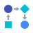
 | `import 'package:koukicons/workflow.dart';` `KoukiconsWorkflow(), `|
| world | 

 | `import 'package:koukicons/world.dart';` `KoukiconsWorld(), `|
| world2 | 

 | `import 'package:koukicons/world2.dart';` `KoukiconsWorld2(), `|
| write | 

 | `import 'package:koukicons/write.dart';` `KoukiconsWrite(), `|
| zoomIn | 

 | `import 'package:koukicons/zoomIn.dart';` `KoukiconsZoomIn(), `|
| zoomOut | 

 | `import 'package:koukicons/zoomOut.dart';` `KoukiconsZoomOut(), `|
