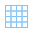

# List of Icons

| Icon name  | Preview  | Code |
|---|---|---|
| about | 

 | Koukicons(Koukicon.about) |
| accept_database | 

 | Koukicons(Koukicon.accept_database) |
| add | 

 | Koukicons(Koukicon.add) |
| add2 | 

 | Koukicons(Koukicon.add2) |
| add3 | 

 | Koukicons(Koukicon.add3) |
| address_book | 

 | Koukicons(Koukicon.address_book) |
| add_app | 

 | Koukicons(Koukicon.add_app) |
| add_column | 

 | Koukicons(Koukicon.add_column) |
| add_database | 

 | Koukicons(Koukicon.add_database) |
| add_image | 

 | Koukicons(Koukicon.add_image) |
| add_row | 

 | Koukicons(Koukicon.add_row) |
| add_win | 

 | Koukicons(Koukicon.add_win) |
| advance | 

 | Koukicons(Koukicon.advance) |
| advertising | 

 | Koukicons(Koukicon.advertising) |
| airdrop | 

 | Koukicons(Koukicon.airdrop) |
| airplay | 

 | Koukicons(Koukicon.airplay) |
| alarm1 | 

 | Koukicons(Koukicon.alarm1) |
| alarm2 | 

 | Koukicons(Koukicon.alarm2) |
| alarmoff | 

 | Koukicons(Koukicon.alarmoff) |
| alarm_clock | 

 | Koukicons(Koukicon.alarm_clock) |
| album | 

 | Koukicons(Koukicon.album) |
| albums | 

 | Koukicons(Koukicon.albums) |
| albums2 | 

 | Koukicons(Koukicon.albums2) |
| albums_view | 

 | Koukicons(Koukicon.albums_view) |
| album_cd | 

 | Koukicons(Koukicon.album_cd) |
| alphabetical_sorting_az | 

 | Koukicons(Koukicon.alphabetical_sorting_az) |
| alphabetical_sorting_za | 

 | Koukicons(Koukicon.alphabetical_sorting_za) |
| answers | 

 | Koukicons(Koukicon.answers) |
| approval | 

 | Koukicons(Koukicon.approval) |
| approve | 

 | Koukicons(Koukicon.approve) |
| archive | 

 | Koukicons(Koukicon.archive) |
| archive2 | 

 | Koukicons(Koukicon.archive2) |
| archive3 | 

 | Koukicons(Koukicon.archive3) |
| area_chart | 

 | Koukicons(Koukicon.area_chart) |
| assistant | 

 | Koukicons(Koukicon.assistant) |
| attach | 

 | Koukicons(Koukicon.attach) |
| audio_file | 

 | Koukicons(Koukicon.audio_file) |
| automatic | 

 | Koukicons(Koukicon.automatic) |
| automotive | 

 | Koukicons(Koukicon.automotive) |
| back | 

 | Koukicons(Koukicon.back) |
| back2 | 

 | Koukicons(Koukicon.back2) |
| bad_decision | 

 | Koukicons(Koukicon.bad_decision) |
| bar_chart | 

 | Koukicons(Koukicon.bar_chart) |
| bearish | 

 | Koukicons(Koukicon.bearish) |
| binoculars | 

 | Koukicons(Koukicon.binoculars) |
| biohazard | 

 | Koukicons(Koukicon.biohazard) |
| biomass | 

 | Koukicons(Koukicon.biomass) |
| biotech | 

 | Koukicons(Koukicon.biotech) |
| blueprint | 

 | Koukicons(Koukicon.blueprint) |
| bluetooth | 

 | Koukicons(Koukicon.bluetooth) |
| bluetooth2 | 

 | Koukicons(Koukicon.bluetooth2) |
| bookmark | 

 | Koukicons(Koukicon.bookmark) |
| bookmark2 | 

 | Koukicons(Koukicon.bookmark2) |
| bookmark_c | 

 | Koukicons(Koukicon.bookmark_c) |
| box | 

 | Koukicons(Koukicon.box) |
| box_archive | 

 | Koukicons(Koukicon.box_archive) |
| box_archive2 | 

 | Koukicons(Koukicon.box_archive2) |
| briefcase | 

 | Koukicons(Koukicon.briefcase) |
| broken_link | 

 | Koukicons(Koukicon.broken_link) |
| broken_link2 | 

 | Koukicons(Koukicon.broken_link2) |
| bullish | 

 | Koukicons(Koukicon.bullish) |
| business | 

 | Koukicons(Koukicon.business) |
| businessman | 

 | Koukicons(Koukicon.businessman) |
| businesswoman | 

 | Koukicons(Koukicon.businesswoman) |
| business_contact | 

 | Koukicons(Koukicon.business_contact) |
| butting_in | 

 | Koukicons(Koukicon.butting_in) |
| cable_release | 

 | Koukicons(Koukicon.cable_release) |
| calc | 

 | Koukicons(Koukicon.calc) |
| calc2 | 

 | Koukicons(Koukicon.calc2) |
| calculator | 

 | Koukicons(Koukicon.calculator) |
| calend | 

 | Koukicons(Koukicon.calend) |
| calendar | 

 | Koukicons(Koukicon.calendar) |
| calendar1 | 

 | Koukicons(Koukicon.calendar1) |
| calendar2 | 

 | Koukicons(Koukicon.calendar2) |
| calendar3 | 

 | Koukicons(Koukicon.calendar3) |
| calendar4 | 

 | Koukicons(Koukicon.calendar4) |
| calendar5 | 

 | Koukicons(Koukicon.calendar5) |
| callback | 

 | Koukicons(Koukicon.callback) |
| call_transfer | 

 | Koukicons(Koukicon.call_transfer) |
| camcorder | 

 | Koukicons(Koukicon.camcorder) |
| camcorder_pro | 

 | Koukicons(Koukicon.camcorder_pro) |
| camera | 

 | Koukicons(Koukicon.camera) |
| camera2 | 

 | Koukicons(Koukicon.camera2) |
| camera_addon | 

 | Koukicons(Koukicon.camera_addon) |
| camera_identification | 

 | Koukicons(Koukicon.camera_identification) |
| camx | 

 | Koukicons(Koukicon.camx) |
| cancel | 

 | Koukicons(Koukicon.cancel) |
| candle_sticks | 

 | Koukicons(Koukicon.candle_sticks) |
| capacitor | 

 | Koukicons(Koukicon.capacitor) |
| case_x | 

 | Koukicons(Koukicon.case_x) |
| cd | 

 | Koukicons(Koukicon.cd) |
| cd2 | 

 | Koukicons(Koukicon.cd2) |
| cell_phone | 

 | Koukicons(Koukicon.cell_phone) |
| charge_battery | 

 | Koukicons(Koukicon.charge_battery) |
| charging_battery | 

 | Koukicons(Koukicon.charging_battery) |
| checklist | 

 | Koukicons(Koukicon.checklist) |
| checkmark | 

 | Koukicons(Koukicon.checkmark) |
| circuit | 

 | Koukicons(Koukicon.circuit) |
| clapperboard | 

 | Koukicons(Koukicon.clapperboard) |
| clear_filters | 

 | Koukicons(Koukicon.clear_filters) |
| clock | 

 | Koukicons(Koukicon.clock) |
| clock2 | 

 | Koukicons(Koukicon.clock2) |
| clocktime | 

 | Koukicons(Koukicon.clocktime) |
| close_up_mode | 

 | Koukicons(Koukicon.close_up_mode) |
| cloth | 

 | Koukicons(Koukicon.cloth) |
| cloud | 

 | Koukicons(Koukicon.cloud) |
| cloud_down | 

 | Koukicons(Koukicon.cloud_down) |
| cloud_search | 

 | Koukicons(Koukicon.cloud_search) |
| cloud_sync | 

 | Koukicons(Koukicon.cloud_sync) |
| cloud_transfert | 

 | Koukicons(Koukicon.cloud_transfert) |
| cloud_upload | 

 | Koukicons(Koukicon.cloud_upload) |
| cloud_warning | 

 | Koukicons(Koukicon.cloud_warning) |
| collaboration | 

 | Koukicons(Koukicon.collaboration) |
| collapse | 

 | Koukicons(Koukicon.collapse) |
| collect | 

 | Koukicons(Koukicon.collect) |
| combo_chart | 

 | Koukicons(Koukicon.combo_chart) |
| command | 

 | Koukicons(Koukicon.command) |
| comments | 

 | Koukicons(Koukicon.comments) |
| compact_camera | 

 | Koukicons(Koukicon.compact_camera) |
| compass | 

 | Koukicons(Koukicon.compass) |
| compose | 

 | Koukicons(Koukicon.compose) |
| conference_call | 

 | Koukicons(Koukicon.conference_call) |
| connected_network | 

 | Koukicons(Koukicon.connected_network) |
| contacts | 

 | Koukicons(Koukicon.contacts) |
| controls1 | 

 | Koukicons(Koukicon.controls1) |
| controls10 | 

 | Koukicons(Koukicon.controls10) |
| controls2 | 

 | Koukicons(Koukicon.controls2) |
| controls3 | 

 | Koukicons(Koukicon.controls3) |
| controls4 | 

 | Koukicons(Koukicon.controls4) |
| controls5 | 

 | Koukicons(Koukicon.controls5) |
| controls6 | 

 | Koukicons(Koukicon.controls6) |
| controls7 | 

 | Koukicons(Koukicon.controls7) |
| controls8 | 

 | Koukicons(Koukicon.controls8) |
| controls9 | 

 | Koukicons(Koukicon.controls9) |
| copyleft | 

 | Koukicons(Koukicon.copyleft) |
| copyright | 

 | Koukicons(Koukicon.copyright) |
| crystal_oscillator | 

 | Koukicons(Koukicon.crystal_oscillator) |
| currency_exchange | 

 | Koukicons(Koukicon.currency_exchange) |
| cursor | 

 | Koukicons(Koukicon.cursor) |
| customer_support | 

 | Koukicons(Koukicon.customer_support) |
| dam | 

 | Koukicons(Koukicon.dam) |
| database | 

 | Koukicons(Koukicon.database) |
| database2 | 

 | Koukicons(Koukicon.database2) |
| database3 | 

 | Koukicons(Koukicon.database3) |
| database_network | 

 | Koukicons(Koukicon.database_network) |
| database_x | 

 | Koukicons(Koukicon.database_x) |
| data_backup | 

 | Koukicons(Koukicon.data_backup) |
| data_configuration | 

 | Koukicons(Koukicon.data_configuration) |
| data_encryption | 

 | Koukicons(Koukicon.data_encryption) |
| data_protection | 

 | Koukicons(Koukicon.data_protection) |
| data_recovery | 

 | Koukicons(Koukicon.data_recovery) |
| data_sheet | 

 | Koukicons(Koukicon.data_sheet) |
| debt | 

 | Koukicons(Koukicon.debt) |
| decision | 

 | Koukicons(Koukicon.decision) |
| delete_column | 

 | Koukicons(Koukicon.delete_column) |
| delete_database | 

 | Koukicons(Koukicon.delete_database) |
| delete_row | 

 | Koukicons(Koukicon.delete_row) |
| department | 

 | Koukicons(Koukicon.department) |
| deployment | 

 | Koukicons(Koukicon.deployment) |
| dial_pad | 

 | Koukicons(Koukicon.dial_pad) |
| diamond | 

 | Koukicons(Koukicon.diamond) |
| diploama_x | 

 | Koukicons(Koukicon.diploama_x) |
| diploma | 

 | Koukicons(Koukicon.diploma) |
| diploma_1 | 

 | Koukicons(Koukicon.diploma_1) |
| disapprove | 

 | Koukicons(Koukicon.disapprove) |
| disclaimer | 

 | Koukicons(Koukicon.disclaimer) |
| disconnected_network | 

 | Koukicons(Koukicon.disconnected_network) |
| dislike | 

 | Koukicons(Koukicon.dislike) |
| disliked | 

 | Koukicons(Koukicon.disliked) |
| display | 

 | Koukicons(Koukicon.display) |
| divide | 

 | Koukicons(Koukicon.divide) |
| divide2 | 

 | Koukicons(Koukicon.divide2) |
| divide3 | 

 | Koukicons(Koukicon.divide3) |
| doc | 

 | Koukicons(Koukicon.doc) |
| document | 

 | Koukicons(Koukicon.document) |
| doc_folder | 

 | Koukicons(Koukicon.doc_folder) |
| doc_folder2 | 

 | Koukicons(Koukicon.doc_folder2) |
| doc_folder4 | 

 | Koukicons(Koukicon.doc_folder4) |
| doc_folder_3 | 

 | Koukicons(Koukicon.doc_folder_3) |
| donate | 

 | Koukicons(Koukicon.donate) |
| doughnut_chart | 

 | Koukicons(Koukicon.doughnut_chart) |
| down | 

 | Koukicons(Koukicon.down) |
| download | 

 | Koukicons(Koukicon.download) |
| download_folder | 

 | Koukicons(Koukicon.download_folder) |
| download_x | 

 | Koukicons(Koukicon.download_x) |
| down_left | 

 | Koukicons(Koukicon.down_left) |
| down_right | 

 | Koukicons(Koukicon.down_right) |
| do_not_inhale | 

 | Koukicons(Koukicon.do_not_inhale) |
| do_not_insert | 

 | Koukicons(Koukicon.do_not_insert) |
| do_not_mix | 

 | Koukicons(Koukicon.do_not_mix) |
| draining_battery | 

 | Koukicons(Koukicon.draining_battery) |
| draining_battery2 | 

 | Koukicons(Koukicon.draining_battery2) |
| driver_licence | 

 | Koukicons(Koukicon.driver_licence) |
| edit | 

 | Koukicons(Koukicon.edit) |
| edit_doc | 

 | Koukicons(Koukicon.edit_doc) |
| edit_image | 

 | Koukicons(Koukicon.edit_image) |
| eject | 

 | Koukicons(Koukicon.eject) |
| eject2 | 

 | Koukicons(Koukicon.eject2) |
| electrical_sensor | 

 | Koukicons(Koukicon.electrical_sensor) |
| electrical_threshold | 

 | Koukicons(Koukicon.electrical_threshold) |
| electricity | 

 | Koukicons(Koukicon.electricity) |
| electronics | 

 | Koukicons(Koukicon.electronics) |
| electro_devices | 

 | Koukicons(Koukicon.electro_devices) |
| employee_badge | 

 | Koukicons(Koukicon.employee_badge) |
| employee_badge2 | 

 | Koukicons(Koukicon.employee_badge2) |
| employee_badge3 | 

 | Koukicons(Koukicon.employee_badge3) |
| employee_badge4 | 

 | Koukicons(Koukicon.employee_badge4) |
| empty_battery | 

 | Koukicons(Koukicon.empty_battery) |
| empty_filter | 

 | Koukicons(Koukicon.empty_filter) |
| empty_trash | 

 | Koukicons(Koukicon.empty_trash) |
| end_call | 

 | Koukicons(Koukicon.end_call) |
| engineering | 

 | Koukicons(Koukicon.engineering) |
| enter | 

 | Koukicons(Koukicon.enter) |
| entering_heaven_alive | 

 | Koukicons(Koukicon.entering_heaven_alive) |
| equal | 

 | Koukicons(Koukicon.equal) |
| equal2 | 

 | Koukicons(Koukicon.equal2) |
| equal3 | 

 | Koukicons(Koukicon.equal3) |
| error | 

 | Koukicons(Koukicon.error) |
| event_date | 

 | Koukicons(Koukicon.event_date) |
| event_date2 | 

 | Koukicons(Koukicon.event_date2) |
| exit_arrow | 

 | Koukicons(Koukicon.exit_arrow) |
| exit_door | 

 | Koukicons(Koukicon.exit_door) |
| exit_door2 | 

 | Koukicons(Koukicon.exit_door2) |
| exit_win | 

 | Koukicons(Koukicon.exit_win) |
| expand | 

 | Koukicons(Koukicon.expand) |
| expired | 

 | Koukicons(Koukicon.expired) |
| export | 

 | Koukicons(Koukicon.export) |
| external | 

 | Koukicons(Koukicon.external) |
| factory | 

 | Koukicons(Koukicon.factory) |
| factory_breakdown | 

 | Koukicons(Koukicon.factory_breakdown) |
| faq | 

 | Koukicons(Koukicon.faq) |
| fast_back | 

 | Koukicons(Koukicon.fast_back) |
| fast_back2 | 

 | Koukicons(Koukicon.fast_back2) |
| fast_forward | 

 | Koukicons(Koukicon.fast_forward) |
| fast_forward2 | 

 | Koukicons(Koukicon.fast_forward2) |
| favourite | 

 | Koukicons(Koukicon.favourite) |
| favourite2 | 

 | Koukicons(Koukicon.favourite2) |
| fax | 

 | Koukicons(Koukicon.fax) |
| feedback | 

 | Koukicons(Koukicon.feedback) |
| feed_in | 

 | Koukicons(Koukicon.feed_in) |
| file | 

 | Koukicons(Koukicon.file) |
| files | 

 | Koukicons(Koukicon.files) |
| files2 | 

 | Koukicons(Koukicon.files2) |
| filing_cabinet | 

 | Koukicons(Koukicon.filing_cabinet) |
| filled_filter | 

 | Koukicons(Koukicon.filled_filter) |
| film | 

 | Koukicons(Koukicon.film) |
| film_reel | 

 | Koukicons(Koukicon.film_reel) |
| fine_print | 

 | Koukicons(Koukicon.fine_print) |
| fingerprint | 

 | Koukicons(Koukicon.fingerprint) |
| flag1 | 

 | Koukicons(Koukicon.flag1) |
| flag2 | 

 | Koukicons(Koukicon.flag2) |
| flag3 | 

 | Koukicons(Koukicon.flag3) |
| flag4 | 

 | Koukicons(Koukicon.flag4) |
| flag5 | 

 | Koukicons(Koukicon.flag5) |
| flash_auto | 

 | Koukicons(Koukicon.flash_auto) |
| flash_off | 

 | Koukicons(Koukicon.flash_off) |
| flash_on | 

 | Koukicons(Koukicon.flash_on) |
| flipboard | 

 | Koukicons(Koukicon.flipboard) |
| flipboard2 | 

 | Koukicons(Koukicon.flipboard2) |
| flow_chart | 

 | Koukicons(Koukicon.flow_chart) |
| focus | 

 | Koukicons(Koukicon.focus) |
| folder | 

 | Koukicons(Koukicon.folder) |
| folder2 | 

 | Koukicons(Koukicon.folder2) |
| folder3 | 

 | Koukicons(Koukicon.folder3) |
| folder4 | 

 | Koukicons(Koukicon.folder4) |
| folder5 | 

 | Koukicons(Koukicon.folder5) |
| folder6 | 

 | Koukicons(Koukicon.folder6) |
| folder7 | 

 | Koukicons(Koukicon.folder7) |
| folder_x | 

 | Koukicons(Koukicon.folder_x) |
| forbidden | 

 | Koukicons(Koukicon.forbidden) |
| forward | 

 | Koukicons(Koukicon.forward) |
| forward2 | 

 | Koukicons(Koukicon.forward2) |
| frame | 

 | Koukicons(Koukicon.frame) |
| frame_pic | 

 | Koukicons(Koukicon.frame_pic) |
| full_battery | 

 | Koukicons(Koukicon.full_battery) |
| full_battery2 | 

 | Koukicons(Koukicon.full_battery2) |
| full_battery3 | 

 | Koukicons(Koukicon.full_battery3) |
| full_trash | 

 | Koukicons(Koukicon.full_trash) |
| funnel | 

 | Koukicons(Koukicon.funnel) |
| gallery | 

 | Koukicons(Koukicon.gallery) |
| gallery_x | 

 | Koukicons(Koukicon.gallery_x) |
| genealogy | 

 | Koukicons(Koukicon.genealogy) |
| generic_sorting_asc | 

 | Koukicons(Koukicon.generic_sorting_asc) |
| generic_sorting_desc | 

 | Koukicons(Koukicon.generic_sorting_desc) |
| gift | 

 | Koukicons(Koukicon.gift) |
| glasses | 

 | Koukicons(Koukicon.glasses) |
| globe | 

 | Koukicons(Koukicon.globe) |
| good_decision | 

 | Koukicons(Koukicon.good_decision) |
| graduation_cap | 

 | Koukicons(Koukicon.graduation_cap) |
| grid | 

 | Koukicons(Koukicon.grid) |
| half_battery | 

 | Koukicons(Koukicon.half_battery) |
| half_battery2 | 

 | Koukicons(Koukicon.half_battery2) |
| hamb_menu | 

 | Koukicons(Koukicon.hamb_menu) |
| hamb_menu2 | 

 | Koukicons(Koukicon.hamb_menu2) |
| headset | 

 | Koukicons(Koukicon.headset) |
| heat_map | 

 | Koukicons(Koukicon.heat_map) |
| help | 

 | Koukicons(Koukicon.help) |
| help2 | 

 | Koukicons(Koukicon.help2) |
| hide | 

 | Koukicons(Koukicon.hide) |
| high_battery | 

 | Koukicons(Koukicon.high_battery) |
| high_priority | 

 | Koukicons(Koukicon.high_priority) |
| high_vol | 

 | Koukicons(Koukicon.high_vol) |
| high_vol2 | 

 | Koukicons(Koukicon.high_vol2) |
| home | 

 | Koukicons(Koukicon.home) |
| home1 | 

 | Koukicons(Koukicon.home1) |
| home2 | 

 | Koukicons(Koukicon.home2) |
| home3 | 

 | Koukicons(Koukicon.home3) |
| home4 | 

 | Koukicons(Koukicon.home4) |
| icons8_cup | 

 | Koukicons(Koukicon.icons8_cup) |
| id | 

 | Koukicons(Koukicon.id) |
| idea | 

 | Koukicons(Koukicon.idea) |
| idea_x | 

 | Koukicons(Koukicon.idea_x) |
| image_file | 

 | Koukicons(Koukicon.image_file) |
| import | 

 | Koukicons(Koukicon.import) |
| important_archive | 

 | Koukicons(Koukicon.important_archive) |
| infinity | 

 | Koukicons(Koukicon.infinity) |
| info | 

 | Koukicons(Koukicon.info) |
| inspection | 

 | Koukicons(Koukicon.inspection) |
| integrated_webcam | 

 | Koukicons(Koukicon.integrated_webcam) |
| internal | 

 | Koukicons(Koukicon.internal) |
| internet | 

 | Koukicons(Koukicon.internet) |
| invite | 

 | Koukicons(Koukicon.invite) |
| in_transit | 

 | Koukicons(Koukicon.in_transit) |
| ipad | 

 | Koukicons(Koukicon.ipad) |
| iphone | 

 | Koukicons(Koukicon.iphone) |
| key1 | 

 | Koukicons(Koukicon.key1) |
| key2 | 

 | Koukicons(Koukicon.key2) |
| kindle | 

 | Koukicons(Koukicon.kindle) |
| knob | 

 | Koukicons(Koukicon.knob) |
| knob2 | 

 | Koukicons(Koukicon.knob2) |
| lamp | 

 | Koukicons(Koukicon.lamp) |
| lan | 

 | Koukicons(Koukicon.lan) |
| landscape | 

 | Koukicons(Koukicon.landscape) |
| layers | 

 | Koukicons(Koukicon.layers) |
| layers2 | 

 | Koukicons(Koukicon.layers2) |
| leaking_battery | 

 | Koukicons(Koukicon.leaking_battery) |
| leave | 

 | Koukicons(Koukicon.leave) |
| left | 

 | Koukicons(Koukicon.left) |
| left_down | 

 | Koukicons(Koukicon.left_down) |
| left_down2 | 

 | Koukicons(Koukicon.left_down2) |
| left_up | 

 | Koukicons(Koukicon.left_up) |
| left_up2 | 

 | Koukicons(Koukicon.left_up2) |
| library | 

 | Koukicons(Koukicon.library) |
| light_at_the_end_of_tunnel | 

 | Koukicons(Koukicon.light_at_the_end_of_tunnel) |
| like | 

 | Koukicons(Koukicon.like) |
| like2 | 

 | Koukicons(Koukicon.like2) |
| like_placeholder | 

 | Koukicons(Koukicon.like_placeholder) |
| like_x | 

 | Koukicons(Koukicon.like_x) |
| line_chart | 

 | Koukicons(Koukicon.line_chart) |
| link | 

 | Koukicons(Koukicon.link) |
| link_green | 

 | Koukicons(Koukicon.link_green) |
| list | 

 | Koukicons(Koukicon.list) |
| live_news | 

 | Koukicons(Koukicon.live_news) |
| location | 

 | Koukicons(Koukicon.location) |
| location2 | 

 | Koukicons(Koukicon.location2) |
| location3 | 

 | Koukicons(Koukicon.location3) |
| location_area | 

 | Koukicons(Koukicon.location_area) |
| location_pin | 

 | Koukicons(Koukicon.location_pin) |
| lock | 

 | Koukicons(Koukicon.lock) |
| lock2 | 

 | Koukicons(Koukicon.lock2) |
| lock3 | 

 | Koukicons(Koukicon.lock3) |
| lock4 | 

 | Koukicons(Koukicon.lock4) |
| locked | 

 | Koukicons(Koukicon.locked) |
| lock_folder | 

 | Koukicons(Koukicon.lock_folder) |
| lock_landscape | 

 | Koukicons(Koukicon.lock_landscape) |
| lock_ori | 

 | Koukicons(Koukicon.lock_ori) |
| lock_portrait | 

 | Koukicons(Koukicon.lock_portrait) |
| lock_x | 

 | Koukicons(Koukicon.lock_x) |
| low_battery | 

 | Koukicons(Koukicon.low_battery) |
| low_battery2 | 

 | Koukicons(Koukicon.low_battery2) |
| low_battery3 | 

 | Koukicons(Koukicon.low_battery3) |
| low_priority | 

 | Koukicons(Koukicon.low_priority) |
| low_vol | 

 | Koukicons(Koukicon.low_vol) |
| low_vol2 | 

 | Koukicons(Koukicon.low_vol2) |
| magic | 

 | Koukicons(Koukicon.magic) |
| magnet1 | 

 | Koukicons(Koukicon.magnet1) |
| magnet2 | 

 | Koukicons(Koukicon.magnet2) |
| magnet3 | 

 | Koukicons(Koukicon.magnet3) |
| make_decision | 

 | Koukicons(Koukicon.make_decision) |
| manager | 

 | Koukicons(Koukicon.manager) |
| map | 

 | Koukicons(Koukicon.map) |
| map2 | 

 | Koukicons(Koukicon.map2) |
| map_location | 

 | Koukicons(Koukicon.map_location) |
| medium_priority | 

 | Koukicons(Koukicon.medium_priority) |
| med_vol | 

 | Koukicons(Koukicon.med_vol) |
| med_vol2 | 

 | Koukicons(Koukicon.med_vol2) |
| menu | 

 | Koukicons(Koukicon.menu) |
| menu2 | 

 | Koukicons(Koukicon.menu2) |
| menu_x | 

 | Koukicons(Koukicon.menu_x) |
| middle_battery | 

 | Koukicons(Koukicon.middle_battery) |
| mind_map | 

 | Koukicons(Koukicon.mind_map) |
| minus | 

 | Koukicons(Koukicon.minus) |
| missed_call | 

 | Koukicons(Koukicon.missed_call) |
| mms | 

 | Koukicons(Koukicon.mms) |
| money_transfer | 

 | Koukicons(Koukicon.money_transfer) |
| more | 

 | Koukicons(Koukicon.more) |
| more2 | 

 | Koukicons(Koukicon.more2) |
| more3 | 

 | Koukicons(Koukicon.more3) |
| movie | 

 | Koukicons(Koukicon.movie) |
| movie2 | 

 | Koukicons(Koukicon.movie2) |
| movie_cam | 

 | Koukicons(Koukicon.movie_cam) |
| multiple_cameras | 

 | Koukicons(Koukicon.multiple_cameras) |
| multiple_devices | 

 | Koukicons(Koukicon.multiple_devices) |
| multiple_inputs | 

 | Koukicons(Koukicon.multiple_inputs) |
| multiple_smartphones | 

 | Koukicons(Koukicon.multiple_smartphones) |
| multiply | 

 | Koukicons(Koukicon.multiply) |
| multiply3 | 

 | Koukicons(Koukicon.multiply3) |
| music | 

 | Koukicons(Koukicon.music) |
| musical | 

 | Koukicons(Koukicon.musical) |
| music_x | 

 | Koukicons(Koukicon.music_x) |
| mute | 

 | Koukicons(Koukicon.mute) |
| mute2 | 

 | Koukicons(Koukicon.mute2) |
| mute3 | 

 | Koukicons(Koukicon.mute3) |
| navigation | 

 | Koukicons(Koukicon.navigation) |
| navigator | 

 | Koukicons(Koukicon.navigator) |
| negative_dynamic | 

 | Koukicons(Koukicon.negative_dynamic) |
| network | 

 | Koukicons(Koukicon.network) |
| network2 | 

 | Koukicons(Koukicon.network2) |
| neutral_decision | 

 | Koukicons(Koukicon.neutral_decision) |
| neutral_trading | 

 | Koukicons(Koukicon.neutral_trading) |
| news | 

 | Koukicons(Koukicon.news) |
| newspaper | 

 | Koukicons(Koukicon.newspaper) |
| next | 

 | Koukicons(Koukicon.next) |
| night_landscape | 

 | Koukicons(Koukicon.night_landscape) |
| night_portrait | 

 | Koukicons(Koukicon.night_portrait) |
| nook | 

 | Koukicons(Koukicon.nook) |
| note | 

 | Koukicons(Koukicon.note) |
| notebook | 

 | Koukicons(Koukicon.notebook) |
| notebook1 | 

 | Koukicons(Koukicon.notebook1) |
| notebook2 | 

 | Koukicons(Koukicon.notebook2) |
| notebook3 | 

 | Koukicons(Koukicon.notebook3) |
| notif | 

 | Koukicons(Koukicon.notif) |
| no_idea | 

 | Koukicons(Koukicon.no_idea) |
| no_video | 

 | Koukicons(Koukicon.no_video) |
| numerical_sorting_12 | 

 | Koukicons(Koukicon.numerical_sorting_12) |
| numerical_sorting_21 | 

 | Koukicons(Koukicon.numerical_sorting_21) |
| off | 

 | Koukicons(Koukicon.off) |
| off_trig | 

 | Koukicons(Koukicon.off_trig) |
| off_trig2 | 

 | Koukicons(Koukicon.off_trig2) |
| ok | 

 | Koukicons(Koukicon.ok) |
| old_time_camera | 

 | Koukicons(Koukicon.old_time_camera) |
| on | 

 | Koukicons(Koukicon.on) |
| online_support | 

 | Koukicons(Koukicon.online_support) |
| on_off | 

 | Koukicons(Koukicon.on_off) |
| on_off_switch | 

 | Koukicons(Koukicon.on_off_switch) |
| on_trig | 

 | Koukicons(Koukicon.on_trig) |
| on_trig2 | 

 | Koukicons(Koukicon.on_trig2) |
| opened_folder | 

 | Koukicons(Koukicon.opened_folder) |
| open_folder | 

 | Koukicons(Koukicon.open_folder) |
| open_folder2 | 

 | Koukicons(Koukicon.open_folder2) |
| organization | 

 | Koukicons(Koukicon.organization) |
| org_unit | 

 | Koukicons(Koukicon.org_unit) |
| overtime | 

 | Koukicons(Koukicon.overtime) |
| package | 

 | Koukicons(Koukicon.package) |
| paid | 

 | Koukicons(Koukicon.paid) |
| panorama | 

 | Koukicons(Koukicon.panorama) |
| parallel_tasks | 

 | Koukicons(Koukicon.parallel_tasks) |
| pause | 

 | Koukicons(Koukicon.pause) |
| pause2 | 

 | Koukicons(Koukicon.pause2) |
| percent | 

 | Koukicons(Koukicon.percent) |
| percent2 | 

 | Koukicons(Koukicon.percent2) |
| perspective | 

 | Koukicons(Koukicon.perspective) |
| phone | 

 | Koukicons(Koukicon.phone) |
| phone_android | 

 | Koukicons(Koukicon.phone_android) |
| phone_apps | 

 | Koukicons(Koukicon.phone_apps) |
| phone_chat | 

 | Koukicons(Koukicon.phone_chat) |
| phone_down | 

 | Koukicons(Koukicon.phone_down) |
| phone_message | 

 | Koukicons(Koukicon.phone_message) |
| phone_profile | 

 | Koukicons(Koukicon.phone_profile) |
| phone_up | 

 | Koukicons(Koukicon.phone_up) |
| phone_vibrate | 

 | Koukicons(Koukicon.phone_vibrate) |
| photo_reel | 

 | Koukicons(Koukicon.photo_reel) |
| pic | 

 | Koukicons(Koukicon.pic) |
| pic2 | 

 | Koukicons(Koukicon.pic2) |
| picture | 

 | Koukicons(Koukicon.picture) |
| pie_chart | 

 | Koukicons(Koukicon.pie_chart) |
| pin | 

 | Koukicons(Koukicon.pin) |
| planner | 

 | Koukicons(Koukicon.planner) |
| play | 

 | Koukicons(Koukicon.play) |
| play2 | 

 | Koukicons(Koukicon.play2) |
| plus | 

 | Koukicons(Koukicon.plus) |
| podium_without_speaker | 

 | Koukicons(Koukicon.podium_without_speaker) |
| podium_with_audience | 

 | Koukicons(Koukicon.podium_with_audience) |
| podium_with_speaker | 

 | Koukicons(Koukicon.podium_with_speaker) |
| portrait_mode | 

 | Koukicons(Koukicon.portrait_mode) |
| positive_dynamic | 

 | Koukicons(Koukicon.positive_dynamic) |
| previous | 

 | Koukicons(Koukicon.previous) |
| price_tag | 

 | Koukicons(Koukicon.price_tag) |
| print | 

 | Koukicons(Koukicon.print) |
| printer | 

 | Koukicons(Koukicon.printer) |
| privacy | 

 | Koukicons(Koukicon.privacy) |
| privacy_x | 

 | Koukicons(Koukicon.privacy_x) |
| process | 

 | Koukicons(Koukicon.process) |
| profile | 

 | Koukicons(Koukicon.profile) |
| profile2 | 

 | Koukicons(Koukicon.profile2) |
| profile3 | 

 | Koukicons(Koukicon.profile3) |
| profile4 | 

 | Koukicons(Koukicon.profile4) |
| profilex | 

 | Koukicons(Koukicon.profilex) |
| profiley | 

 | Koukicons(Koukicon.profiley) |
| promote | 

 | Koukicons(Koukicon.promote) |
| promote2 | 

 | Koukicons(Koukicon.promote2) |
| puzzle | 

 | Koukicons(Koukicon.puzzle) |
| questions | 

 | Koukicons(Koukicon.questions) |
| radar | 

 | Koukicons(Koukicon.radar) |
| radar_plot | 

 | Koukicons(Koukicon.radar_plot) |
| rating | 

 | Koukicons(Koukicon.rating) |
| ratings | 

 | Koukicons(Koukicon.ratings) |
| reading | 

 | Koukicons(Koukicon.reading) |
| reading_ebook | 

 | Koukicons(Koukicon.reading_ebook) |
| read_x | 

 | Koukicons(Koukicon.read_x) |
| receive | 

 | Koukicons(Koukicon.receive) |
| record | 

 | Koukicons(Koukicon.record) |
| redo | 

 | Koukicons(Koukicon.redo) |
| refresh | 

 | Koukicons(Koukicon.refresh) |
| registered_trademark | 

 | Koukicons(Koukicon.registered_trademark) |
| remove_image | 

 | Koukicons(Koukicon.remove_image) |
| repeat | 

 | Koukicons(Koukicon.repeat) |
| repeat2 | 

 | Koukicons(Koukicon.repeat2) |
| report | 

 | Koukicons(Koukicon.report) |
| restart | 

 | Koukicons(Koukicon.restart) |
| resumee | 

 | Koukicons(Koukicon.resumee) |
| reuse | 

 | Koukicons(Koukicon.reuse) |
| right | 

 | Koukicons(Koukicon.right) |
| right_down | 

 | Koukicons(Koukicon.right_down) |
| right_down2 | 

 | Koukicons(Koukicon.right_down2) |
| right_up | 

 | Koukicons(Koukicon.right_up) |
| right_up2 | 

 | Koukicons(Koukicon.right_up2) |
| ringing | 

 | Koukicons(Koukicon.ringing) |
| ringing2 | 

 | Koukicons(Koukicon.ringing2) |
| roadmap | 

 | Koukicons(Koukicon.roadmap) |
| rotate_camera | 

 | Koukicons(Koukicon.rotate_camera) |
| rotate_land | 

 | Koukicons(Koukicon.rotate_land) |
| rotate_port | 

 | Koukicons(Koukicon.rotate_port) |
| rotate_to_landscape | 

 | Koukicons(Koukicon.rotate_to_landscape) |
| rotate_to_portrait | 

 | Koukicons(Koukicon.rotate_to_portrait) |
| ruler | 

 | Koukicons(Koukicon.ruler) |
| rules | 

 | Koukicons(Koukicon.rules) |
| safe | 

 | Koukicons(Koukicon.safe) |
| safety | 

 | Koukicons(Koukicon.safety) |
| sales_performance | 

 | Koukicons(Koukicon.sales_performance) |
| save | 

 | Koukicons(Koukicon.save) |
| scatter_plot | 

 | Koukicons(Koukicon.scatter_plot) |
| search | 

 | Koukicons(Koukicon.search) |
| search1 | 

 | Koukicons(Koukicon.search1) |
| search2 | 

 | Koukicons(Koukicon.search2) |
| search_file | 

 | Koukicons(Koukicon.search_file) |
| search_phone | 

 | Koukicons(Koukicon.search_phone) |
| search_x | 

 | Koukicons(Koukicon.search_x) |
| select_tab | 

 | Koukicons(Koukicon.select_tab) |
| select_win | 

 | Koukicons(Koukicon.select_win) |
| select_win2 | 

 | Koukicons(Koukicon.select_win2) |
| selfie | 

 | Koukicons(Koukicon.selfie) |
| self_service_kiosk | 

 | Koukicons(Koukicon.self_service_kiosk) |
| send | 

 | Koukicons(Koukicon.send) |
| send2 | 

 | Koukicons(Koukicon.send2) |
| send3 | 

 | Koukicons(Koukicon.send3) |
| serial_tasks | 

 | Koukicons(Koukicon.serial_tasks) |
| services | 

 | Koukicons(Koukicon.services) |
| service_mark | 

 | Koukicons(Koukicon.service_mark) |
| settings | 

 | Koukicons(Koukicon.settings) |
| settings1 | 

 | Koukicons(Koukicon.settings1) |
| settings10 | 

 | Koukicons(Koukicon.settings10) |
| settings2 | 

 | Koukicons(Koukicon.settings2) |
| settings3 | 

 | Koukicons(Koukicon.settings3) |
| settings4 | 

 | Koukicons(Koukicon.settings4) |
| settings5 | 

 | Koukicons(Koukicon.settings5) |
| settings6 | 

 | Koukicons(Koukicon.settings6) |
| settings7 | 

 | Koukicons(Koukicon.settings7) |
| settings8 | 

 | Koukicons(Koukicon.settings8) |
| settings9 | 

 | Koukicons(Koukicon.settings9) |
| share | 

 | Koukicons(Koukicon.share) |
| share1 | 

 | Koukicons(Koukicon.share1) |
| share2 | 

 | Koukicons(Koukicon.share2) |
| share3 | 

 | Koukicons(Koukicon.share3) |
| shipped | 

 | Koukicons(Koukicon.shipped) |
| shop | 

 | Koukicons(Koukicon.shop) |
| shuffle | 

 | Koukicons(Koukicon.shuffle) |
| shuffle2 | 

 | Koukicons(Koukicon.shuffle2) |
| shutdown | 

 | Koukicons(Koukicon.shutdown) |
| sign | 

 | Koukicons(Koukicon.sign) |
| signature | 

 | Koukicons(Koukicon.signature) |
| signpost | 

 | Koukicons(Koukicon.signpost) |
| silent | 

 | Koukicons(Koukicon.silent) |
| silent2 | 

 | Koukicons(Koukicon.silent2) |
| sim_card | 

 | Koukicons(Koukicon.sim_card) |
| sim_card_chip | 

 | Koukicons(Koukicon.sim_card_chip) |
| siri | 

 | Koukicons(Koukicon.siri) |
| slr_back_side | 

 | Koukicons(Koukicon.slr_back_side) |
| smartphone_tablet | 

 | Koukicons(Koukicon.smartphone_tablet) |
| sms | 

 | Koukicons(Koukicon.sms) |
| sound_recording_copyright | 

 | Koukicons(Koukicon.sound_recording_copyright) |
| speaker | 

 | Koukicons(Koukicon.speaker) |
| speed | 

 | Koukicons(Koukicon.speed) |
| sports_mode | 

 | Koukicons(Koukicon.sports_mode) |
| spotlight | 

 | Koukicons(Koukicon.spotlight) |
| stack_of_photos | 

 | Koukicons(Koukicon.stack_of_photos) |
| star | 

 | Koukicons(Koukicon.star) |
| start | 

 | Koukicons(Koukicon.start) |
| statistics | 

 | Koukicons(Koukicon.statistics) |
| stop | 

 | Koukicons(Koukicon.stop) |
| stop2 | 

 | Koukicons(Koukicon.stop2) |
| stopwatch | 

 | Koukicons(Koukicon.stopwatch) |
| stopwatch2 | 

 | Koukicons(Koukicon.stopwatch2) |
| stopwatch3 | 

 | Koukicons(Koukicon.stopwatch3) |
| street_location | 

 | Koukicons(Koukicon.street_location) |
| street_name | 

 | Koukicons(Koukicon.street_name) |
| street_orien | 

 | Koukicons(Koukicon.street_orien) |
| substract | 

 | Koukicons(Koukicon.substract) |
| substract2 | 

 | Koukicons(Koukicon.substract2) |
| success | 

 | Koukicons(Koukicon.success) |
| success2 | 

 | Koukicons(Koukicon.success2) |
| success3 | 

 | Koukicons(Koukicon.success3) |
| support | 

 | Koukicons(Koukicon.support) |
| survey | 

 | Koukicons(Koukicon.survey) |
| susbstract2 | 

 | Koukicons(Koukicon.susbstract2) |
| switch_camera | 

 | Koukicons(Koukicon.switch_camera) |
| switch_off | 

 | Koukicons(Koukicon.switch_off) |
| synchronize | 

 | Koukicons(Koukicon.synchronize) |
| tablet_android | 

 | Koukicons(Koukicon.tablet_android) |
| tabs | 

 | Koukicons(Koukicon.tabs) |
| take_note | 

 | Koukicons(Koukicon.take_note) |
| take_note2 | 

 | Koukicons(Koukicon.take_note2) |
| target | 

 | Koukicons(Koukicon.target) |
| tech_power | 

 | Koukicons(Koukicon.tech_power) |
| template | 

 | Koukicons(Koukicon.template) |
| thumb_down | 

 | Koukicons(Koukicon.thumb_down) |
| thumb_up | 

 | Koukicons(Koukicon.thumb_up) |
| time | 

 | Koukicons(Koukicon.time) |
| timeline | 

 | Koukicons(Koukicon.timeline) |
| timetracking | 

 | Koukicons(Koukicon.timetracking) |
| timetracking2 | 

 | Koukicons(Koukicon.timetracking2) |
| timetracking3 | 

 | Koukicons(Koukicon.timetracking3) |
| time_flies | 

 | Koukicons(Koukicon.time_flies) |
| todo_list | 

 | Koukicons(Koukicon.todo_list) |
| touchscreen_smartphone | 

 | Koukicons(Koukicon.touchscreen_smartphone) |
| track | 

 | Koukicons(Koukicon.track) |
| tracked | 

 | Koukicons(Koukicon.tracked) |
| trademark | 

 | Koukicons(Koukicon.trademark) |
| trash | 

 | Koukicons(Koukicon.trash) |
| trash2 | 

 | Koukicons(Koukicon.trash2) |
| trash3 | 

 | Koukicons(Koukicon.trash3) |
| trash4 | 

 | Koukicons(Koukicon.trash4) |
| tree_structure | 

 | Koukicons(Koukicon.tree_structure) |
| two_smartphones | 

 | Koukicons(Koukicon.two_smartphones) |
| undo | 

 | Koukicons(Koukicon.undo) |
| unlink | 

 | Koukicons(Koukicon.unlink) |
| unlock | 

 | Koukicons(Koukicon.unlock) |
| unlock2 | 

 | Koukicons(Koukicon.unlock2) |
| unlock3 | 

 | Koukicons(Koukicon.unlock3) |
| unlock4 | 

 | Koukicons(Koukicon.unlock4) |
| unlocked | 

 | Koukicons(Koukicon.unlocked) |
| unlocked2 | 

 | Koukicons(Koukicon.unlocked2) |
| unlock_folder | 

 | Koukicons(Koukicon.unlock_folder) |
| unlock_ori | 

 | Koukicons(Koukicon.unlock_ori) |
| up | 

 | Koukicons(Koukicon.up) |
| upload | 

 | Koukicons(Koukicon.upload) |
| upload_folder | 

 | Koukicons(Koukicon.upload_folder) |
| upload_x | 

 | Koukicons(Koukicon.upload_x) |
| up_left | 

 | Koukicons(Koukicon.up_left) |
| up_right | 

 | Koukicons(Koukicon.up_right) |
| users | 

 | Koukicons(Koukicon.users) |
| users2 | 

 | Koukicons(Koukicon.users2) |
| user_f | 

 | Koukicons(Koukicon.user_f) |
| user_m | 

 | Koukicons(Koukicon.user_m) |
| vid2 | 

 | Koukicons(Koukicon.vid2) |
| vid3 | 

 | Koukicons(Koukicon.vid3) |
| video | 

 | Koukicons(Koukicon.video) |
| video_call | 

 | Koukicons(Koukicon.video_call) |
| video_file | 

 | Koukicons(Koukicon.video_file) |
| video_projector | 

 | Koukicons(Koukicon.video_projector) |
| view | 

 | Koukicons(Koukicon.view) |
| view2 | 

 | Koukicons(Koukicon.view2) |
| views | 

 | Koukicons(Koukicon.views) |
| view_details | 

 | Koukicons(Koukicon.view_details) |
| vip | 

 | Koukicons(Koukicon.vip) |
| voice | 

 | Koukicons(Koukicon.voice) |
| voicemail | 

 | Koukicons(Koukicon.voicemail) |
| voice_presentation | 

 | Koukicons(Koukicon.voice_presentation) |
| volume_ | 

 | Koukicons(Koukicon.volume_) |
| volume_add | 

 | Koukicons(Koukicon.volume_add) |
| warning | 

 | Koukicons(Koukicon.warning) |
| webcam | 

 | Koukicons(Koukicon.webcam) |
| wifi | 

 | Koukicons(Koukicon.wifi) |
| wifi_signal | 

 | Koukicons(Koukicon.wifi_signal) |
| win | 

 | Koukicons(Koukicon.win) |
| win2 | 

 | Koukicons(Koukicon.win2) |
| workflow | 

 | Koukicons(Koukicon.workflow) |
| world | 

 | Koukicons(Koukicon.world) |
| world2 | 

 | Koukicons(Koukicon.world2) |
| write | 

 | Koukicons(Koukicon.write) |
| zoom_in | 

 | Koukicons(Koukicon.zoom_in) |
| zoom_out | 

 | Koukicons(Koukicon.zoom_out) |
