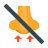

# List of Icons

| Icon name  | Preview  | Code |
|---|---|---|
| about | 

 | Koukicons(Koukicon.about) |
| acceptDatabase | 

 | Koukicons(Koukicon.acceptDatabase) |
| add | 

 | Koukicons(Koukicon.add) |
| add2 | 

 | Koukicons(Koukicon.add2) |
| add3 | 

 | Koukicons(Koukicon.add3) |
| addApp | 

 | Koukicons(Koukicon.addApp) |
| addColumn | 

 | Koukicons(Koukicon.addColumn) |
| addDatabase | 

 | Koukicons(Koukicon.addDatabase) |
| addImage | 

 | Koukicons(Koukicon.addImage) |
| addressBook | 

 | Koukicons(Koukicon.addressBook) |
| addRow | 

 | Koukicons(Koukicon.addRow) |
| addWin | 

 | Koukicons(Koukicon.addWin) |
| advance | 

 | Koukicons(Koukicon.advance) |
| advertising | 

 | Koukicons(Koukicon.advertising) |
| airdrop | 

 | Koukicons(Koukicon.airdrop) |
| airplay | 

 | Koukicons(Koukicon.airplay) |
| alarm1 | 

 | Koukicons(Koukicon.alarm1) |
| alarm2 | 

 | Koukicons(Koukicon.alarm2) |
| alarmClock | 

 | Koukicons(Koukicon.alarmClock) |
| alarmoff | 

 | Koukicons(Koukicon.alarmoff) |
| album | 

 | Koukicons(Koukicon.album) |
| albumCd | 

 | Koukicons(Koukicon.albumCd) |
| albums | 

 | Koukicons(Koukicon.albums) |
| albums2 | 

 | Koukicons(Koukicon.albums2) |
| albumsView | 

 | Koukicons(Koukicon.albumsView) |
| alphabeticalSortingAz | 

 | Koukicons(Koukicon.alphabeticalSortingAz) |
| alphabeticalSortingZa | 

 | Koukicons(Koukicon.alphabeticalSortingZa) |
| answers | 

 | Koukicons(Koukicon.answers) |
| approval | 

 | Koukicons(Koukicon.approval) |
| approve | 

 | Koukicons(Koukicon.approve) |
| archive | 

 | Koukicons(Koukicon.archive) |
| archive2 | 

 | Koukicons(Koukicon.archive2) |
| archive3 | 

 | Koukicons(Koukicon.archive3) |
| areaChart | 

 | Koukicons(Koukicon.areaChart) |
| assistant | 

 | Koukicons(Koukicon.assistant) |
| attach | 

 | Koukicons(Koukicon.attach) |
| audioFile | 

 | Koukicons(Koukicon.audioFile) |
| automatic | 

 | Koukicons(Koukicon.automatic) |
| automotive | 

 | Koukicons(Koukicon.automotive) |
| back | 

 | Koukicons(Koukicon.back) |
| back2 | 

 | Koukicons(Koukicon.back2) |
| badDecision | 

 | Koukicons(Koukicon.badDecision) |
| barChart | 

 | Koukicons(Koukicon.barChart) |
| bearish | 

 | Koukicons(Koukicon.bearish) |
| binoculars | 

 | Koukicons(Koukicon.binoculars) |
| biohazard | 

 | Koukicons(Koukicon.biohazard) |
| biomass | 

 | Koukicons(Koukicon.biomass) |
| biotech | 

 | Koukicons(Koukicon.biotech) |
| blueprint | 

 | Koukicons(Koukicon.blueprint) |
| bluetooth | 

 | Koukicons(Koukicon.bluetooth) |
| bluetooth2 | 

 | Koukicons(Koukicon.bluetooth2) |
| bookmark | 

 | Koukicons(Koukicon.bookmark) |
| bookmark2 | 

 | Koukicons(Koukicon.bookmark2) |
| bookmarkC | 

 | Koukicons(Koukicon.bookmarkC) |
| box | 

 | Koukicons(Koukicon.box) |
| boxArchive | 

 | Koukicons(Koukicon.boxArchive) |
| boxArchive2 | 

 | Koukicons(Koukicon.boxArchive2) |
| briefcase | 

 | Koukicons(Koukicon.briefcase) |
| brokenLink | 

 | Koukicons(Koukicon.brokenLink) |
| brokenLink2 | 

 | Koukicons(Koukicon.brokenLink2) |
| bullish | 

 | Koukicons(Koukicon.bullish) |
| business | 

 | Koukicons(Koukicon.business) |
| businessContact | 

 | Koukicons(Koukicon.businessContact) |
| businessman | 

 | Koukicons(Koukicon.businessman) |
| businesswoman | 

 | Koukicons(Koukicon.businesswoman) |
| buttingIn | 

 | Koukicons(Koukicon.buttingIn) |
| cableRelease | 

 | Koukicons(Koukicon.cableRelease) |
| calc | 

 | Koukicons(Koukicon.calc) |
| calc2 | 

 | Koukicons(Koukicon.calc2) |
| calculator | 

 | Koukicons(Koukicon.calculator) |
| calend | 

 | Koukicons(Koukicon.calend) |
| calendar | 

 | Koukicons(Koukicon.calendar) |
| calendar1 | 

 | Koukicons(Koukicon.calendar1) |
| calendar2 | 

 | Koukicons(Koukicon.calendar2) |
| calendar3 | 

 | Koukicons(Koukicon.calendar3) |
| calendar4 | 

 | Koukicons(Koukicon.calendar4) |
| calendar5 | 

 | Koukicons(Koukicon.calendar5) |
| callback | 

 | Koukicons(Koukicon.callback) |
| callTransfer | 

 | Koukicons(Koukicon.callTransfer) |
| camcorder | 

 | Koukicons(Koukicon.camcorder) |
| camcorderPro | 

 | Koukicons(Koukicon.camcorderPro) |
| camera | 

 | Koukicons(Koukicon.camera) |
| camera2 | 

 | Koukicons(Koukicon.camera2) |
| cameraAddon | 

 | Koukicons(Koukicon.cameraAddon) |
| cameraIdentification | 

 | Koukicons(Koukicon.cameraIdentification) |
| camx | 

 | Koukicons(Koukicon.camx) |
| cancel | 

 | Koukicons(Koukicon.cancel) |
| candleSticks | 

 | Koukicons(Koukicon.candleSticks) |
| capacitor | 

 | Koukicons(Koukicon.capacitor) |
| caseX | 

 | Koukicons(Koukicon.caseX) |
| cd | 

 | Koukicons(Koukicon.cd) |
| cd2 | 

 | Koukicons(Koukicon.cd2) |
| cellPhone | 

 | Koukicons(Koukicon.cellPhone) |
| chargeBattery | 

 | Koukicons(Koukicon.chargeBattery) |
| chargingBattery | 

 | Koukicons(Koukicon.chargingBattery) |
| checklist | 

 | Koukicons(Koukicon.checklist) |
| checkmark | 

 | Koukicons(Koukicon.checkmark) |
| circuit | 

 | Koukicons(Koukicon.circuit) |
| clapperboard | 

 | Koukicons(Koukicon.clapperboard) |
| clearFilters | 

 | Koukicons(Koukicon.clearFilters) |
| clock | 

 | Koukicons(Koukicon.clock) |
| clock2 | 

 | Koukicons(Koukicon.clock2) |
| clocktime | 

 | Koukicons(Koukicon.clocktime) |
| closeUpMode | 

 | Koukicons(Koukicon.closeUpMode) |
| cloth | 

 | Koukicons(Koukicon.cloth) |
| cloud | 

 | Koukicons(Koukicon.cloud) |
| cloudDown | 

 | Koukicons(Koukicon.cloudDown) |
| cloudSearch | 

 | Koukicons(Koukicon.cloudSearch) |
| cloudSync | 

 | Koukicons(Koukicon.cloudSync) |
| cloudTransfert | 

 | Koukicons(Koukicon.cloudTransfert) |
| cloudUpload | 

 | Koukicons(Koukicon.cloudUpload) |
| cloudWarning | 

 | Koukicons(Koukicon.cloudWarning) |
| collaboration | 

 | Koukicons(Koukicon.collaboration) |
| collapse | 

 | Koukicons(Koukicon.collapse) |
| collect | 

 | Koukicons(Koukicon.collect) |
| comboChart | 

 | Koukicons(Koukicon.comboChart) |
| command | 

 | Koukicons(Koukicon.command) |
| comments | 

 | Koukicons(Koukicon.comments) |
| compactCamera | 

 | Koukicons(Koukicon.compactCamera) |
| compass | 

 | Koukicons(Koukicon.compass) |
| compose | 

 | Koukicons(Koukicon.compose) |
| conferenceCall | 

 | Koukicons(Koukicon.conferenceCall) |
| connectedNetwork | 

 | Koukicons(Koukicon.connectedNetwork) |
| contacts | 

 | Koukicons(Koukicon.contacts) |
| controls1 | 

 | Koukicons(Koukicon.controls1) |
| controls10 | 

 | Koukicons(Koukicon.controls10) |
| controls2 | 

 | Koukicons(Koukicon.controls2) |
| controls3 | 

 | Koukicons(Koukicon.controls3) |
| controls4 | 

 | Koukicons(Koukicon.controls4) |
| controls5 | 

 | Koukicons(Koukicon.controls5) |
| controls6 | 

 | Koukicons(Koukicon.controls6) |
| controls7 | 

 | Koukicons(Koukicon.controls7) |
| controls8 | 

 | Koukicons(Koukicon.controls8) |
| controls9 | 

 | Koukicons(Koukicon.controls9) |
| copyleft | 

 | Koukicons(Koukicon.copyleft) |
| copyright | 

 | Koukicons(Koukicon.copyright) |
| crystalOscillator | 

 | Koukicons(Koukicon.crystalOscillator) |
| currencyExchange | 

 | Koukicons(Koukicon.currencyExchange) |
| cursor | 

 | Koukicons(Koukicon.cursor) |
| customerSupport | 

 | Koukicons(Koukicon.customerSupport) |
| dam | 

 | Koukicons(Koukicon.dam) |
| dataBackup | 

 | Koukicons(Koukicon.dataBackup) |
| database | 

 | Koukicons(Koukicon.database) |
| database2 | 

 | Koukicons(Koukicon.database2) |
| database3 | 

 | Koukicons(Koukicon.database3) |
| databaseNetwork | 

 | Koukicons(Koukicon.databaseNetwork) |
| databaseX | 

 | Koukicons(Koukicon.databaseX) |
| dataConfiguration | 

 | Koukicons(Koukicon.dataConfiguration) |
| dataEncryption | 

 | Koukicons(Koukicon.dataEncryption) |
| dataProtection | 

 | Koukicons(Koukicon.dataProtection) |
| dataRecovery | 

 | Koukicons(Koukicon.dataRecovery) |
| dataSheet | 

 | Koukicons(Koukicon.dataSheet) |
| debt | 

 | Koukicons(Koukicon.debt) |
| decision | 

 | Koukicons(Koukicon.decision) |
| deleteColumn | 

 | Koukicons(Koukicon.deleteColumn) |
| deleteDatabase | 

 | Koukicons(Koukicon.deleteDatabase) |
| deleteRow | 

 | Koukicons(Koukicon.deleteRow) |
| department | 

 | Koukicons(Koukicon.department) |
| deployment | 

 | Koukicons(Koukicon.deployment) |
| dialPad | 

 | Koukicons(Koukicon.dialPad) |
| diamond | 

 | Koukicons(Koukicon.diamond) |
| diploamaX | 

 | Koukicons(Koukicon.diploamaX) |
| diploma | 

 | Koukicons(Koukicon.diploma) |
| diploma1 | 

 | Koukicons(Koukicon.diploma1) |
| disapprove | 

 | Koukicons(Koukicon.disapprove) |
| disclaimer | 

 | Koukicons(Koukicon.disclaimer) |
| disconnectedNetwork | 

 | Koukicons(Koukicon.disconnectedNetwork) |
| dislike | 

 | Koukicons(Koukicon.dislike) |
| disliked | 

 | Koukicons(Koukicon.disliked) |
| display | 

 | Koukicons(Koukicon.display) |
| divide | 

 | Koukicons(Koukicon.divide) |
| divide2 | 

 | Koukicons(Koukicon.divide2) |
| divide3 | 

 | Koukicons(Koukicon.divide3) |
| doc | 

 | Koukicons(Koukicon.doc) |
| docFolder | 

 | Koukicons(Koukicon.docFolder) |
| docFolder2 | 

 | Koukicons(Koukicon.docFolder2) |
| docFolder3 | 

 | Koukicons(Koukicon.docFolder3) |
| docFolder4 | 

 | Koukicons(Koukicon.docFolder4) |
| document | 

 | Koukicons(Koukicon.document) |
| donate | 

 | Koukicons(Koukicon.donate) |
| doNotInhale | 

 | Koukicons(Koukicon.doNotInhale) |
| doNotInsert | 

 | Koukicons(Koukicon.doNotInsert) |
| doNotMix | 

 | Koukicons(Koukicon.doNotMix) |
| doughnutChart | 

 | Koukicons(Koukicon.doughnutChart) |
| down | 

 | Koukicons(Koukicon.down) |
| downLeft | 

 | Koukicons(Koukicon.downLeft) |
| download | 

 | Koukicons(Koukicon.download) |
| downloadFolder | 

 | Koukicons(Koukicon.downloadFolder) |
| downloadX | 

 | Koukicons(Koukicon.downloadX) |
| downRight | 

 | Koukicons(Koukicon.downRight) |
| drainingBattery | 

 | Koukicons(Koukicon.drainingBattery) |
| drainingBattery2 | 

 | Koukicons(Koukicon.drainingBattery2) |
| driverLicence | 

 | Koukicons(Koukicon.driverLicence) |
| edit | 

 | Koukicons(Koukicon.edit) |
| editDoc | 

 | Koukicons(Koukicon.editDoc) |
| editImage | 

 | Koukicons(Koukicon.editImage) |
| eject | 

 | Koukicons(Koukicon.eject) |
| eject2 | 

 | Koukicons(Koukicon.eject2) |
| electricalSensor | 

 | Koukicons(Koukicon.electricalSensor) |
| electricalThreshold | 

 | Koukicons(Koukicon.electricalThreshold) |
| electricity | 

 | Koukicons(Koukicon.electricity) |
| electroDevices | 

 | Koukicons(Koukicon.electroDevices) |
| electronics | 

 | Koukicons(Koukicon.electronics) |
| employeeBadge | 

 | Koukicons(Koukicon.employeeBadge) |
| employeeBadge2 | 

 | Koukicons(Koukicon.employeeBadge2) |
| employeeBadge3 | 

 | Koukicons(Koukicon.employeeBadge3) |
| employeeBadge4 | 

 | Koukicons(Koukicon.employeeBadge4) |
| emptyBattery | 

 | Koukicons(Koukicon.emptyBattery) |
| emptyFilter | 

 | Koukicons(Koukicon.emptyFilter) |
| emptyTrash | 

 | Koukicons(Koukicon.emptyTrash) |
| endCall | 

 | Koukicons(Koukicon.endCall) |
| engineering | 

 | Koukicons(Koukicon.engineering) |
| enter | 

 | Koukicons(Koukicon.enter) |
| enteringHeavenAlive | 

 | Koukicons(Koukicon.enteringHeavenAlive) |
| equal | 

 | Koukicons(Koukicon.equal) |
| equal2 | 

 | Koukicons(Koukicon.equal2) |
| equal3 | 

 | Koukicons(Koukicon.equal3) |
| error | 

 | Koukicons(Koukicon.error) |
| eventDate | 

 | Koukicons(Koukicon.eventDate) |
| eventDate2 | 

 | Koukicons(Koukicon.eventDate2) |
| exitArrow | 

 | Koukicons(Koukicon.exitArrow) |
| exitDoor | 

 | Koukicons(Koukicon.exitDoor) |
| exitDoor2 | 

 | Koukicons(Koukicon.exitDoor2) |
| exitWin | 

 | Koukicons(Koukicon.exitWin) |
| expand | 

 | Koukicons(Koukicon.expand) |
| expired | 

 | Koukicons(Koukicon.expired) |
| export | 

 | Koukicons(Koukicon.export) |
| external | 

 | Koukicons(Koukicon.external) |
| factory | 

 | Koukicons(Koukicon.factory) |
| factoryBreakdown | 

 | Koukicons(Koukicon.factoryBreakdown) |
| faq | 

 | Koukicons(Koukicon.faq) |
| fastBack | 

 | Koukicons(Koukicon.fastBack) |
| fastBack2 | 

 | Koukicons(Koukicon.fastBack2) |
| fastForward | 

 | Koukicons(Koukicon.fastForward) |
| fastForward2 | 

 | Koukicons(Koukicon.fastForward2) |
| favourite | 

 | Koukicons(Koukicon.favourite) |
| favourite2 | 

 | Koukicons(Koukicon.favourite2) |
| fax | 

 | Koukicons(Koukicon.fax) |
| feedback | 

 | Koukicons(Koukicon.feedback) |
| feedIn | 

 | Koukicons(Koukicon.feedIn) |
| file | 

 | Koukicons(Koukicon.file) |
| files | 

 | Koukicons(Koukicon.files) |
| files2 | 

 | Koukicons(Koukicon.files2) |
| filingCabinet | 

 | Koukicons(Koukicon.filingCabinet) |
| filledFilter | 

 | Koukicons(Koukicon.filledFilter) |
| film | 

 | Koukicons(Koukicon.film) |
| filmReel | 

 | Koukicons(Koukicon.filmReel) |
| finePrint | 

 | Koukicons(Koukicon.finePrint) |
| fingerprint | 

 | Koukicons(Koukicon.fingerprint) |
| flag1 | 

 | Koukicons(Koukicon.flag1) |
| flag2 | 

 | Koukicons(Koukicon.flag2) |
| flag3 | 

 | Koukicons(Koukicon.flag3) |
| flag4 | 

 | Koukicons(Koukicon.flag4) |
| flag5 | 

 | Koukicons(Koukicon.flag5) |
| flashAuto | 

 | Koukicons(Koukicon.flashAuto) |
| flashOff | 

 | Koukicons(Koukicon.flashOff) |
| flashOn | 

 | Koukicons(Koukicon.flashOn) |
| flipboard | 

 | Koukicons(Koukicon.flipboard) |
| flipboard2 | 

 | Koukicons(Koukicon.flipboard2) |
| flowChart | 

 | Koukicons(Koukicon.flowChart) |
| focus | 

 | Koukicons(Koukicon.focus) |
| folder | 

 | Koukicons(Koukicon.folder) |
| folder2 | 

 | Koukicons(Koukicon.folder2) |
| folder3 | 

 | Koukicons(Koukicon.folder3) |
| folder4 | 

 | Koukicons(Koukicon.folder4) |
| folder5 | 

 | Koukicons(Koukicon.folder5) |
| folder6 | 

 | Koukicons(Koukicon.folder6) |
| folder7 | 

 | Koukicons(Koukicon.folder7) |
| folderX | 

 | Koukicons(Koukicon.folderX) |
| forbidden | 

 | Koukicons(Koukicon.forbidden) |
| forward | 

 | Koukicons(Koukicon.forward) |
| forward2 | 

 | Koukicons(Koukicon.forward2) |
| frame | 

 | Koukicons(Koukicon.frame) |
| framePic | 

 | Koukicons(Koukicon.framePic) |
| fullBattery | 

 | Koukicons(Koukicon.fullBattery) |
| fullBattery2 | 

 | Koukicons(Koukicon.fullBattery2) |
| fullBattery3 | 

 | Koukicons(Koukicon.fullBattery3) |
| fullTrash | 

 | Koukicons(Koukicon.fullTrash) |
| funnel | 

 | Koukicons(Koukicon.funnel) |
| gallery | 

 | Koukicons(Koukicon.gallery) |
| galleryX | 

 | Koukicons(Koukicon.galleryX) |
| genealogy | 

 | Koukicons(Koukicon.genealogy) |
| genericSortingAsc | 

 | Koukicons(Koukicon.genericSortingAsc) |
| genericSortingDesc | 

 | Koukicons(Koukicon.genericSortingDesc) |
| gift | 

 | Koukicons(Koukicon.gift) |
| glasses | 

 | Koukicons(Koukicon.glasses) |
| globe | 

 | Koukicons(Koukicon.globe) |
| goodDecision | 

 | Koukicons(Koukicon.goodDecision) |
| graduationCap | 

 | Koukicons(Koukicon.graduationCap) |
| grid | 

 | Koukicons(Koukicon.grid) |
| halfBattery | 

 | Koukicons(Koukicon.halfBattery) |
| halfBattery2 | 

 | Koukicons(Koukicon.halfBattery2) |
| hambMenu | 

 | Koukicons(Koukicon.hambMenu) |
| hambMenu2 | 

 | Koukicons(Koukicon.hambMenu2) |
| headset | 

 | Koukicons(Koukicon.headset) |
| heatMap | 

 | Koukicons(Koukicon.heatMap) |
| help | 

 | Koukicons(Koukicon.help) |
| help2 | 

 | Koukicons(Koukicon.help2) |
| hide | 

 | Koukicons(Koukicon.hide) |
| highBattery | 

 | Koukicons(Koukicon.highBattery) |
| highPriority | 

 | Koukicons(Koukicon.highPriority) |
| highVol | 

 | Koukicons(Koukicon.highVol) |
| highVol2 | 

 | Koukicons(Koukicon.highVol2) |
| home | 

 | Koukicons(Koukicon.home) |
| home1 | 

 | Koukicons(Koukicon.home1) |
| home2 | 

 | Koukicons(Koukicon.home2) |
| home3 | 

 | Koukicons(Koukicon.home3) |
| home4 | 

 | Koukicons(Koukicon.home4) |
| icons8Cup | 

 | Koukicons(Koukicon.icons8Cup) |
| id | 

 | Koukicons(Koukicon.id) |
| idea | 

 | Koukicons(Koukicon.idea) |
| ideaX | 

 | Koukicons(Koukicon.ideaX) |
| imageFile | 

 | Koukicons(Koukicon.imageFile) |
| import | 

 | Koukicons(Koukicon.import) |
| importantArchive | 

 | Koukicons(Koukicon.importantArchive) |
| infinity | 

 | Koukicons(Koukicon.infinity) |
| info | 

 | Koukicons(Koukicon.info) |
| inspection | 

 | Koukicons(Koukicon.inspection) |
| integratedWebcam | 

 | Koukicons(Koukicon.integratedWebcam) |
| internal | 

 | Koukicons(Koukicon.internal) |
| internet | 

 | Koukicons(Koukicon.internet) |
| inTransit | 

 | Koukicons(Koukicon.inTransit) |
| invite | 

 | Koukicons(Koukicon.invite) |
| ipad | 

 | Koukicons(Koukicon.ipad) |
| iphone | 

 | Koukicons(Koukicon.iphone) |
| key1 | 

 | Koukicons(Koukicon.key1) |
| key2 | 

 | Koukicons(Koukicon.key2) |
| kindle | 

 | Koukicons(Koukicon.kindle) |
| knob | 

 | Koukicons(Koukicon.knob) |
| knob2 | 

 | Koukicons(Koukicon.knob2) |
| lamp | 

 | Koukicons(Koukicon.lamp) |
| lan | 

 | Koukicons(Koukicon.lan) |
| landscape | 

 | Koukicons(Koukicon.landscape) |
| layers | 

 | Koukicons(Koukicon.layers) |
| layers2 | 

 | Koukicons(Koukicon.layers2) |
| leakingBattery | 

 | Koukicons(Koukicon.leakingBattery) |
| leave | 

 | Koukicons(Koukicon.leave) |
| left | 

 | Koukicons(Koukicon.left) |
| leftDown | 

 | Koukicons(Koukicon.leftDown) |
| leftDown2 | 

 | Koukicons(Koukicon.leftDown2) |
| leftUp | 

 | Koukicons(Koukicon.leftUp) |
| leftUp2 | 

 | Koukicons(Koukicon.leftUp2) |
| library | 

 | Koukicons(Koukicon.library) |
| lightAtTheEndOfTunnel | 

 | Koukicons(Koukicon.lightAtTheEndOfTunnel) |
| like | 

 | Koukicons(Koukicon.like) |
| like2 | 

 | Koukicons(Koukicon.like2) |
| likePlaceholder | 

 | Koukicons(Koukicon.likePlaceholder) |
| likeX | 

 | Koukicons(Koukicon.likeX) |
| lineChart | 

 | Koukicons(Koukicon.lineChart) |
| link | 

 | Koukicons(Koukicon.link) |
| linkGreen | 

 | Koukicons(Koukicon.linkGreen) |
| list | 

 | Koukicons(Koukicon.list) |
| liveNews | 

 | Koukicons(Koukicon.liveNews) |
| location | 

 | Koukicons(Koukicon.location) |
| location2 | 

 | Koukicons(Koukicon.location2) |
| location3 | 

 | Koukicons(Koukicon.location3) |
| locationArea | 

 | Koukicons(Koukicon.locationArea) |
| locationPin | 

 | Koukicons(Koukicon.locationPin) |
| lock | 

 | Koukicons(Koukicon.lock) |
| lock2 | 

 | Koukicons(Koukicon.lock2) |
| lock3 | 

 | Koukicons(Koukicon.lock3) |
| lock4 | 

 | Koukicons(Koukicon.lock4) |
| locked | 

 | Koukicons(Koukicon.locked) |
| lockFolder | 

 | Koukicons(Koukicon.lockFolder) |
| lockLandscape | 

 | Koukicons(Koukicon.lockLandscape) |
| lockOri | 

 | Koukicons(Koukicon.lockOri) |
| lockPortrait | 

 | Koukicons(Koukicon.lockPortrait) |
| lockX | 

 | Koukicons(Koukicon.lockX) |
| lowBattery | 

 | Koukicons(Koukicon.lowBattery) |
| lowBattery2 | 

 | Koukicons(Koukicon.lowBattery2) |
| lowBattery3 | 

 | Koukicons(Koukicon.lowBattery3) |
| lowPriority | 

 | Koukicons(Koukicon.lowPriority) |
| lowVol | 

 | Koukicons(Koukicon.lowVol) |
| lowVol2 | 

 | Koukicons(Koukicon.lowVol2) |
| magic | 

 | Koukicons(Koukicon.magic) |
| magnet1 | 

 | Koukicons(Koukicon.magnet1) |
| magnet2 | 

 | Koukicons(Koukicon.magnet2) |
| magnet3 | 

 | Koukicons(Koukicon.magnet3) |
| makeDecision | 

 | Koukicons(Koukicon.makeDecision) |
| manager | 

 | Koukicons(Koukicon.manager) |
| map | 

 | Koukicons(Koukicon.map) |
| map2 | 

 | Koukicons(Koukicon.map2) |
| mapLocation | 

 | Koukicons(Koukicon.mapLocation) |
| mediumPriority | 

 | Koukicons(Koukicon.mediumPriority) |
| medVol | 

 | Koukicons(Koukicon.medVol) |
| medVol2 | 

 | Koukicons(Koukicon.medVol2) |
| menu | 

 | Koukicons(Koukicon.menu) |
| menu2 | 

 | Koukicons(Koukicon.menu2) |
| menuX | 

 | Koukicons(Koukicon.menuX) |
| middleBattery | 

 | Koukicons(Koukicon.middleBattery) |
| mindMap | 

 | Koukicons(Koukicon.mindMap) |
| minus | 

 | Koukicons(Koukicon.minus) |
| missedCall | 

 | Koukicons(Koukicon.missedCall) |
| mms | 

 | Koukicons(Koukicon.mms) |
| moneyTransfer | 

 | Koukicons(Koukicon.moneyTransfer) |
| more | 

 | Koukicons(Koukicon.more) |
| more2 | 

 | Koukicons(Koukicon.more2) |
| more3 | 

 | Koukicons(Koukicon.more3) |
| movie | 

 | Koukicons(Koukicon.movie) |
| movie2 | 

 | Koukicons(Koukicon.movie2) |
| movieCam | 

 | Koukicons(Koukicon.movieCam) |
| multipleCameras | 

 | Koukicons(Koukicon.multipleCameras) |
| multipleDevices | 

 | Koukicons(Koukicon.multipleDevices) |
| multipleInputs | 

 | Koukicons(Koukicon.multipleInputs) |
| multipleSmartphones | 

 | Koukicons(Koukicon.multipleSmartphones) |
| multiply | 

 | Koukicons(Koukicon.multiply) |
| multiply3 | 

 | Koukicons(Koukicon.multiply3) |
| music | 

 | Koukicons(Koukicon.music) |
| musical | 

 | Koukicons(Koukicon.musical) |
| musicX | 

 | Koukicons(Koukicon.musicX) |
| mute | 

 | Koukicons(Koukicon.mute) |
| mute2 | 

 | Koukicons(Koukicon.mute2) |
| mute3 | 

 | Koukicons(Koukicon.mute3) |
| navigation | 

 | Koukicons(Koukicon.navigation) |
| navigator | 

 | Koukicons(Koukicon.navigator) |
| negativeDynamic | 

 | Koukicons(Koukicon.negativeDynamic) |
| network | 

 | Koukicons(Koukicon.network) |
| network2 | 

 | Koukicons(Koukicon.network2) |
| neutralDecision | 

 | Koukicons(Koukicon.neutralDecision) |
| neutralTrading | 

 | Koukicons(Koukicon.neutralTrading) |
| news | 

 | Koukicons(Koukicon.news) |
| newspaper | 

 | Koukicons(Koukicon.newspaper) |
| next | 

 | Koukicons(Koukicon.next) |
| nightLandscape | 

 | Koukicons(Koukicon.nightLandscape) |
| nightPortrait | 

 | Koukicons(Koukicon.nightPortrait) |
| noIdea | 

 | Koukicons(Koukicon.noIdea) |
| nook | 

 | Koukicons(Koukicon.nook) |
| note | 

 | Koukicons(Koukicon.note) |
| notebook | 

 | Koukicons(Koukicon.notebook) |
| notebook1 | 

 | Koukicons(Koukicon.notebook1) |
| notebook2 | 

 | Koukicons(Koukicon.notebook2) |
| notebook3 | 

 | Koukicons(Koukicon.notebook3) |
| notif | 

 | Koukicons(Koukicon.notif) |
| noVideo | 

 | Koukicons(Koukicon.noVideo) |
| numericalSorting12 | 

 | Koukicons(Koukicon.numericalSorting12) |
| numericalSorting21 | 

 | Koukicons(Koukicon.numericalSorting21) |
| off | 

 | Koukicons(Koukicon.off) |
| offTrig | 

 | Koukicons(Koukicon.offTrig) |
| offTrig2 | 

 | Koukicons(Koukicon.offTrig2) |
| ok | 

 | Koukicons(Koukicon.ok) |
| oldTimeCamera | 

 | Koukicons(Koukicon.oldTimeCamera) |
| on | 

 | Koukicons(Koukicon.on) |
| onlineSupport | 

 | Koukicons(Koukicon.onlineSupport) |
| onOff | 

 | Koukicons(Koukicon.onOff) |
| onOffSwitch | 

 | Koukicons(Koukicon.onOffSwitch) |
| onTrig | 

 | Koukicons(Koukicon.onTrig) |
| onTrig2 | 

 | Koukicons(Koukicon.onTrig2) |
| openedFolder | 

 | Koukicons(Koukicon.openedFolder) |
| openFolder | 

 | Koukicons(Koukicon.openFolder) |
| openFolder2 | 

 | Koukicons(Koukicon.openFolder2) |
| organization | 

 | Koukicons(Koukicon.organization) |
| orgUnit | 

 | Koukicons(Koukicon.orgUnit) |
| overtime | 

 | Koukicons(Koukicon.overtime) |
| package | 

 | Koukicons(Koukicon.package) |
| paid | 

 | Koukicons(Koukicon.paid) |
| panorama | 

 | Koukicons(Koukicon.panorama) |
| parallelTasks | 

 | Koukicons(Koukicon.parallelTasks) |
| pause | 

 | Koukicons(Koukicon.pause) |
| pause2 | 

 | Koukicons(Koukicon.pause2) |
| percent | 

 | Koukicons(Koukicon.percent) |
| percent2 | 

 | Koukicons(Koukicon.percent2) |
| perspective | 

 | Koukicons(Koukicon.perspective) |
| phone | 

 | Koukicons(Koukicon.phone) |
| phoneAndroid | 

 | Koukicons(Koukicon.phoneAndroid) |
| phoneApps | 

 | Koukicons(Koukicon.phoneApps) |
| phoneChat | 

 | Koukicons(Koukicon.phoneChat) |
| phoneDown | 

 | Koukicons(Koukicon.phoneDown) |
| phoneMessage | 

 | Koukicons(Koukicon.phoneMessage) |
| phoneProfile | 

 | Koukicons(Koukicon.phoneProfile) |
| phoneUp | 

 | Koukicons(Koukicon.phoneUp) |
| phoneVibrate | 

 | Koukicons(Koukicon.phoneVibrate) |
| photoReel | 

 | Koukicons(Koukicon.photoReel) |
| pic | 

 | Koukicons(Koukicon.pic) |
| pic2 | 

 | Koukicons(Koukicon.pic2) |
| picture | 

 | Koukicons(Koukicon.picture) |
| pieChart | 

 | Koukicons(Koukicon.pieChart) |
| pin | 

 | Koukicons(Koukicon.pin) |
| planner | 

 | Koukicons(Koukicon.planner) |
| play | 

 | Koukicons(Koukicon.play) |
| play2 | 

 | Koukicons(Koukicon.play2) |
| plus | 

 | Koukicons(Koukicon.plus) |
| podiumWithAudience | 

 | Koukicons(Koukicon.podiumWithAudience) |
| podiumWithoutSpeaker | 

 | Koukicons(Koukicon.podiumWithoutSpeaker) |
| podiumWithSpeaker | 

 | Koukicons(Koukicon.podiumWithSpeaker) |
| portraitMode | 

 | Koukicons(Koukicon.portraitMode) |
| positiveDynamic | 

 | Koukicons(Koukicon.positiveDynamic) |
| previous | 

 | Koukicons(Koukicon.previous) |
| priceTag | 

 | Koukicons(Koukicon.priceTag) |
| print | 

 | Koukicons(Koukicon.print) |
| printer | 

 | Koukicons(Koukicon.printer) |
| privacy | 

 | Koukicons(Koukicon.privacy) |
| privacyX | 

 | Koukicons(Koukicon.privacyX) |
| process | 

 | Koukicons(Koukicon.process) |
| profile | 

 | Koukicons(Koukicon.profile) |
| profile2 | 

 | Koukicons(Koukicon.profile2) |
| profile3 | 

 | Koukicons(Koukicon.profile3) |
| profile4 | 

 | Koukicons(Koukicon.profile4) |
| profilex | 

 | Koukicons(Koukicon.profilex) |
| profiley | 

 | Koukicons(Koukicon.profiley) |
| promote | 

 | Koukicons(Koukicon.promote) |
| promote2 | 

 | Koukicons(Koukicon.promote2) |
| puzzle | 

 | Koukicons(Koukicon.puzzle) |
| questions | 

 | Koukicons(Koukicon.questions) |
| radar | 

 | Koukicons(Koukicon.radar) |
| radarPlot | 

 | Koukicons(Koukicon.radarPlot) |
| rating | 

 | Koukicons(Koukicon.rating) |
| ratings | 

 | Koukicons(Koukicon.ratings) |
| reading | 

 | Koukicons(Koukicon.reading) |
| readingEbook | 

 | Koukicons(Koukicon.readingEbook) |
| readX | 

 | Koukicons(Koukicon.readX) |
| receive | 

 | Koukicons(Koukicon.receive) |
| record | 

 | Koukicons(Koukicon.record) |
| redo | 

 | Koukicons(Koukicon.redo) |
| refresh | 

 | Koukicons(Koukicon.refresh) |
| registeredTrademark | 

 | Koukicons(Koukicon.registeredTrademark) |
| removeImage | 

 | Koukicons(Koukicon.removeImage) |
| repeat | 

 | Koukicons(Koukicon.repeat) |
| repeat2 | 

 | Koukicons(Koukicon.repeat2) |
| report | 

 | Koukicons(Koukicon.report) |
| restart | 

 | Koukicons(Koukicon.restart) |
| resumee | 

 | Koukicons(Koukicon.resumee) |
| reuse | 

 | Koukicons(Koukicon.reuse) |
| right | 

 | Koukicons(Koukicon.right) |
| rightDown | 

 | Koukicons(Koukicon.rightDown) |
| rightDown2 | 

 | Koukicons(Koukicon.rightDown2) |
| rightUp | 

 | Koukicons(Koukicon.rightUp) |
| rightUp2 | 

 | Koukicons(Koukicon.rightUp2) |
| ringing | 

 | Koukicons(Koukicon.ringing) |
| ringing2 | 

 | Koukicons(Koukicon.ringing2) |
| roadmap | 

 | Koukicons(Koukicon.roadmap) |
| rotateCamera | 

 | Koukicons(Koukicon.rotateCamera) |
| rotateLand | 

 | Koukicons(Koukicon.rotateLand) |
| rotatePort | 

 | Koukicons(Koukicon.rotatePort) |
| rotateToLandscape | 

 | Koukicons(Koukicon.rotateToLandscape) |
| rotateToPortrait | 

 | Koukicons(Koukicon.rotateToPortrait) |
| ruler | 

 | Koukicons(Koukicon.ruler) |
| rules | 

 | Koukicons(Koukicon.rules) |
| safe | 

 | Koukicons(Koukicon.safe) |
| safety | 

 | Koukicons(Koukicon.safety) |
| salesPerformance | 

 | Koukicons(Koukicon.salesPerformance) |
| save | 

 | Koukicons(Koukicon.save) |
| scatterPlot | 

 | Koukicons(Koukicon.scatterPlot) |
| search | 

 | Koukicons(Koukicon.search) |
| search1 | 

 | Koukicons(Koukicon.search1) |
| search2 | 

 | Koukicons(Koukicon.search2) |
| searchFile | 

 | Koukicons(Koukicon.searchFile) |
| searchPhone | 

 | Koukicons(Koukicon.searchPhone) |
| searchX | 

 | Koukicons(Koukicon.searchX) |
| selectTab | 

 | Koukicons(Koukicon.selectTab) |
| selectWin | 

 | Koukicons(Koukicon.selectWin) |
| selectWin2 | 

 | Koukicons(Koukicon.selectWin2) |
| selfie | 

 | Koukicons(Koukicon.selfie) |
| selfServiceKiosk | 

 | Koukicons(Koukicon.selfServiceKiosk) |
| send | 

 | Koukicons(Koukicon.send) |
| send2 | 

 | Koukicons(Koukicon.send2) |
| send3 | 

 | Koukicons(Koukicon.send3) |
| serialTasks | 

 | Koukicons(Koukicon.serialTasks) |
| serviceMark | 

 | Koukicons(Koukicon.serviceMark) |
| services | 

 | Koukicons(Koukicon.services) |
| settings | 

 | Koukicons(Koukicon.settings) |
| settings1 | 

 | Koukicons(Koukicon.settings1) |
| settings10 | 

 | Koukicons(Koukicon.settings10) |
| settings2 | 

 | Koukicons(Koukicon.settings2) |
| settings3 | 

 | Koukicons(Koukicon.settings3) |
| settings4 | 

 | Koukicons(Koukicon.settings4) |
| settings5 | 

 | Koukicons(Koukicon.settings5) |
| settings6 | 

 | Koukicons(Koukicon.settings6) |
| settings7 | 

 | Koukicons(Koukicon.settings7) |
| settings8 | 

 | Koukicons(Koukicon.settings8) |
| settings9 | 

 | Koukicons(Koukicon.settings9) |
| share | 

 | Koukicons(Koukicon.share) |
| share1 | 

 | Koukicons(Koukicon.share1) |
| share2 | 

 | Koukicons(Koukicon.share2) |
| share3 | 

 | Koukicons(Koukicon.share3) |
| shipped | 

 | Koukicons(Koukicon.shipped) |
| shop | 

 | Koukicons(Koukicon.shop) |
| shuffle | 

 | Koukicons(Koukicon.shuffle) |
| shuffle2 | 

 | Koukicons(Koukicon.shuffle2) |
| shutdown | 

 | Koukicons(Koukicon.shutdown) |
| sign | 

 | Koukicons(Koukicon.sign) |
| signature | 

 | Koukicons(Koukicon.signature) |
| signpost | 

 | Koukicons(Koukicon.signpost) |
| silent | 

 | Koukicons(Koukicon.silent) |
| silent2 | 

 | Koukicons(Koukicon.silent2) |
| simCard | 

 | Koukicons(Koukicon.simCard) |
| simCardChip | 

 | Koukicons(Koukicon.simCardChip) |
| siri | 

 | Koukicons(Koukicon.siri) |
| slrBackSide | 

 | Koukicons(Koukicon.slrBackSide) |
| smartphoneTablet | 

 | Koukicons(Koukicon.smartphoneTablet) |
| sms | 

 | Koukicons(Koukicon.sms) |
| soundRecordingCopyright | 

 | Koukicons(Koukicon.soundRecordingCopyright) |
| speaker | 

 | Koukicons(Koukicon.speaker) |
| speed | 

 | Koukicons(Koukicon.speed) |
| sportsMode | 

 | Koukicons(Koukicon.sportsMode) |
| spotlight | 

 | Koukicons(Koukicon.spotlight) |
| stackOfPhotos | 

 | Koukicons(Koukicon.stackOfPhotos) |
| star | 

 | Koukicons(Koukicon.star) |
| start | 

 | Koukicons(Koukicon.start) |
| statistics | 

 | Koukicons(Koukicon.statistics) |
| stop | 

 | Koukicons(Koukicon.stop) |
| stop2 | 

 | Koukicons(Koukicon.stop2) |
| stopwatch | 

 | Koukicons(Koukicon.stopwatch) |
| stopwatch2 | 

 | Koukicons(Koukicon.stopwatch2) |
| stopwatch3 | 

 | Koukicons(Koukicon.stopwatch3) |
| streetLocation | 

 | Koukicons(Koukicon.streetLocation) |
| streetName | 

 | Koukicons(Koukicon.streetName) |
| streetOrien | 

 | Koukicons(Koukicon.streetOrien) |
| substract | 

 | Koukicons(Koukicon.substract) |
| substract2 | 

 | Koukicons(Koukicon.substract2) |
| success | 

 | Koukicons(Koukicon.success) |
| success2 | 

 | Koukicons(Koukicon.success2) |
| success3 | 

 | Koukicons(Koukicon.success3) |
| support | 

 | Koukicons(Koukicon.support) |
| survey | 

 | Koukicons(Koukicon.survey) |
| susbstract2 | 

 | Koukicons(Koukicon.susbstract2) |
| switchCamera | 

 | Koukicons(Koukicon.switchCamera) |
| switchOff | 

 | Koukicons(Koukicon.switchOff) |
| synchronize | 

 | Koukicons(Koukicon.synchronize) |
| tabletAndroid | 

 | Koukicons(Koukicon.tabletAndroid) |
| tabs | 

 | Koukicons(Koukicon.tabs) |
| takeNote | 

 | Koukicons(Koukicon.takeNote) |
| takeNote2 | 

 | Koukicons(Koukicon.takeNote2) |
| target | 

 | Koukicons(Koukicon.target) |
| techPower | 

 | Koukicons(Koukicon.techPower) |
| template | 

 | Koukicons(Koukicon.template) |
| thumbDown | 

 | Koukicons(Koukicon.thumbDown) |
| thumbUp | 

 | Koukicons(Koukicon.thumbUp) |
| time | 

 | Koukicons(Koukicon.time) |
| timeFlies | 

 | Koukicons(Koukicon.timeFlies) |
| timeline | 

 | Koukicons(Koukicon.timeline) |
| timetracking | 

 | Koukicons(Koukicon.timetracking) |
| timetracking2 | 

 | Koukicons(Koukicon.timetracking2) |
| timetracking3 | 

 | Koukicons(Koukicon.timetracking3) |
| todoList | 

 | Koukicons(Koukicon.todoList) |
| touchscreenSmartphone | 

 | Koukicons(Koukicon.touchscreenSmartphone) |
| track | 

 | Koukicons(Koukicon.track) |
| tracked | 

 | Koukicons(Koukicon.tracked) |
| trademark | 

 | Koukicons(Koukicon.trademark) |
| trash | 

 | Koukicons(Koukicon.trash) |
| trash2 | 

 | Koukicons(Koukicon.trash2) |
| trash3 | 

 | Koukicons(Koukicon.trash3) |
| trash4 | 

 | Koukicons(Koukicon.trash4) |
| treeStructure | 

 | Koukicons(Koukicon.treeStructure) |
| twoSmartphones | 

 | Koukicons(Koukicon.twoSmartphones) |
| undo | 

 | Koukicons(Koukicon.undo) |
| unlink | 

 | Koukicons(Koukicon.unlink) |
| unlock | 

 | Koukicons(Koukicon.unlock) |
| unlock2 | 

 | Koukicons(Koukicon.unlock2) |
| unlock3 | 

 | Koukicons(Koukicon.unlock3) |
| unlock4 | 

 | Koukicons(Koukicon.unlock4) |
| unlocked | 

 | Koukicons(Koukicon.unlocked) |
| unlocked2 | 

 | Koukicons(Koukicon.unlocked2) |
| unlockFolder | 

 | Koukicons(Koukicon.unlockFolder) |
| unlockOri | 

 | Koukicons(Koukicon.unlockOri) |
| up | 

 | Koukicons(Koukicon.up) |
| upLeft | 

 | Koukicons(Koukicon.upLeft) |
| upload | 

 | Koukicons(Koukicon.upload) |
| uploadFolder | 

 | Koukicons(Koukicon.uploadFolder) |
| uploadX | 

 | Koukicons(Koukicon.uploadX) |
| upRight | 

 | Koukicons(Koukicon.upRight) |
| userF | 

 | Koukicons(Koukicon.userF) |
| userM | 

 | Koukicons(Koukicon.userM) |
| users | 

 | Koukicons(Koukicon.users) |
| users2 | 

 | Koukicons(Koukicon.users2) |
| vid2 | 

 | Koukicons(Koukicon.vid2) |
| vid3 | 

 | Koukicons(Koukicon.vid3) |
| video | 

 | Koukicons(Koukicon.video) |
| videoCall | 

 | Koukicons(Koukicon.videoCall) |
| videoFile | 

 | Koukicons(Koukicon.videoFile) |
| videoProjector | 

 | Koukicons(Koukicon.videoProjector) |
| view | 

 | Koukicons(Koukicon.view) |
| view2 | 

 | Koukicons(Koukicon.view2) |
| viewDetails | 

 | Koukicons(Koukicon.viewDetails) |
| views | 

 | Koukicons(Koukicon.views) |
| vip | 

 | Koukicons(Koukicon.vip) |
| voice | 

 | Koukicons(Koukicon.voice) |
| voicemail | 

 | Koukicons(Koukicon.voicemail) |
| voicePresentation | 

 | Koukicons(Koukicon.voicePresentation) |
| volume | 

 | Koukicons(Koukicon.volume) |
| volumeAdd | 

 | Koukicons(Koukicon.volumeAdd) |
| warning | 

 | Koukicons(Koukicon.warning) |
| webcam | 

 | Koukicons(Koukicon.webcam) |
| wifi | 

 | Koukicons(Koukicon.wifi) |
| wifiSignal | 

 | Koukicons(Koukicon.wifiSignal) |
| win | 

 | Koukicons(Koukicon.win) |
| win2 | 

 | Koukicons(Koukicon.win2) |
| workflow | 

 | Koukicons(Koukicon.workflow) |
| world | 

 | Koukicons(Koukicon.world) |
| world2 | 

 | Koukicons(Koukicon.world2) |
| write | 

 | Koukicons(Koukicon.write) |
| zoomIn | 

 | Koukicons(Koukicon.zoomIn) |
| zoomOut | 

 | Koukicons(Koukicon.zoomOut) |
