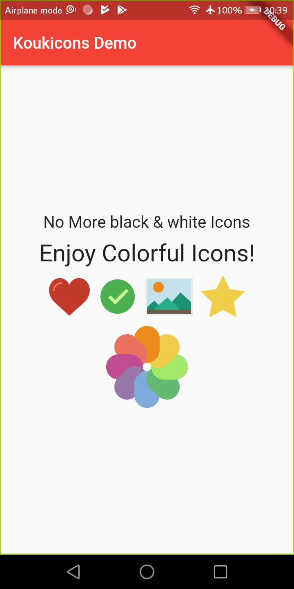

<p align="center">
  
</p>

# Koukicons

🍪 This package provides Colorful Icons for Flutter Apps

# Screenshot

<p align="center">
  
</p>

# How to use

To use this plugin, add `koukicons` as a dependency in your pubspec.yaml file.

That's it! start using Icons - for example : `Koukicons(Koukicon.like),`

### Example

``` dart
import 'package:koukicons/koukions.dart';
...
Column(
  children: <Widget>[
    Text("I"),
    Koukicons(Koukicon.like),
    Text("You"),
  ],
),
```

# List of Icons

To Discover all the icons, [Click Here](ListIcons.md)

# Add new Icons

1. Fork this repository

2. Copy/paste your new SVG file inside "assets" folder ( __Icon name must be lowercase letters, no numbers in first character & no special character__ )

3. Inside "Tool" folder, run "generator.py"

```
python generator.py
```

4. Pull request and eat some cookies 🍪🍪🍪 
